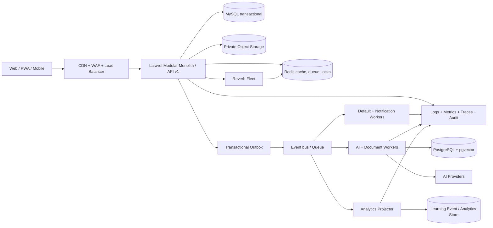

# Báo cáo audit toàn diện SmartLMS

**Ngày đánh giá:** 09/08/2026  
**Phạm vi:** Production `https://smartlms.io.vn`, mã nguồn Laravel trong workspace, cấu hình Docker/Nginx/Reverb, migration, test suite và tài liệu benchmark chính thức.  
**Mục tiêu:** giảm thao tác của giáo viên, tự động hóa công việc lặp lại, giúp học sinh biết việc cần làm tiếp theo và dùng AI ở nơi tạo giá trị thực.

---

## 0. Cách đọc và giới hạn của báo cáo

### Nhãn bằng chứng

- **[V] Đã kiểm chứng:** đã quan sát trực tiếp trên production, mã nguồn, migration, cấu hình hoặc test chạy thành công.
- **[S] Suy luận:** kết luận kỹ thuật có cơ sở từ thiết kế hiện tại nhưng chưa được đo trong tải production hoặc chưa thao tác đủ mọi role.
- **[ĐX] Đề xuất:** trạng thái đích; không được hiểu là chức năng đang tồn tại.

### Phạm vi kiểm chứng thực tế

- **[V]** Đã duyệt production với phiên giáo viên hiện hữu: dashboard, lớp, tiến độ lớp, khóa học/lesson, bài tập và modal tạo bài, lịch, điểm danh, kho học liệu, ngân hàng câu hỏi, tài liệu RAG, thông báo.
- **[V]** Đã kiểm tra responsive ở viewport mobile và desktop, accessibility tree, console của trình duyệt.
- **[V]** Đã đọc routes, policies, controllers/services, migrations, Docker/Nginx, queue/cache/session, AI/RAG, file upload/preview và broadcast channels.
- **[V]** PHPUnit: **136 test, 624 assertion, đều pass**. Vite production build và Pint đều pass.
- **[V]** E2E Playwright không chạy được do Chrome trong môi trường audit bị `SIGABRT/EPERM`; đây là lỗi môi trường chạy test, **không phải** bằng chứng sản phẩm fail.
- **[V]** Tài liệu load test trong repo chỉ đo public read: khoảng 291 rps/p95 222 ms ở 50 user và 283 rps/p95 434 ms ở 100 user. Không dùng số này để kết luận hiệu năng luồng đăng nhập, dashboard, gradebook hay AI.
- Chưa thực hiện pentest phá hoại, tải độc hại thật, kiểm thử phục hồi backup, tải đồng thời production hoặc thao tác trực tiếp bằng tài khoản Admin/Học sinh. Những phần đó được ghi **[S]** hoặc thành checklist cần chạy.
- Dữ liệu cá nhân nhìn thấy trong phiên audit không được đưa vào báo cáo; chỉ dùng số tổng hợp.

---

# 1. Tổng quan sản phẩm

## 1.1 SmartLMS đang ở mức nào?

**Kết luận: LMS trung bình-cao, có một số module ở mức LMS nâng cao; chưa phải nền tảng quản lý giáo dục hoàn chỉnh.**

SmartLMS đã vượt một LMS cơ bản vì có course template/versioning, ngân hàng câu hỏi nhiều loại, thi online, RAG theo quyền khóa học, AI operation tracking, dashboard role-based, lịch, điểm danh, kho học liệu và policy/test bảo vệ dữ liệu. Tuy nhiên ba nền móng của một LMS hoàn chỉnh còn thiếu hoặc chưa đủ chín:

1. **Gradebook chính quy:** category, trọng số, grade item, lịch sử thay đổi, khóa/chốt điểm, rubric/outcome và quy tắc làm tròn.
2. **Workflow/automation:** hiện chủ yếu là notification hard-code; chưa có rule engine, đa kênh, quiet hours, escalation và execution log.
3. **Learning analytics tin cậy:** có snapshot tiến độ và danh sách cần chú ý, nhưng semantic còn mâu thuẫn, chưa có learning-event model, confidence/explanation và quy trình can thiệp.

### Những gì đang giải quyết tốt cho giáo viên

- **[V]** Tạo và quản lý course delivery/template, module/lesson, tìm kiếm trong outline và xem thử với vai trò học sinh.
- **[V]** Ngân hàng 143 câu hỏi trên production có lọc độ khó/loại/trạng thái, AI sinh câu hỏi, quality review và thao tác hàng loạt.
- **[V]** Dashboard đưa việc cần chấm, lịch dạy, lớp phụ trách và học sinh cần chú ý về một chỗ.
- **[V]** Lịch tuần/tháng, copy ngày, import Excel và tạo lịch trực tiếp trên ô lịch.
- **[V]** Điểm danh một chạm, lịch sử theo cột/buổi và xuất dữ liệu.
- **[V]** Kho học liệu dùng lại giữa khóa học, tài liệu nội bộ cho RAG, phân quyền truy xuất theo course.
- **[V]** AI hỗ trợ course plan, lesson, quiz/question và phân tích lớp; các tác vụ dài quan trọng đã có queue/AI operation để theo dõi.

### Những gì đang giải quyết tốt cho học sinh

- **[V/S]** Học sinh có luồng course/lesson, assignment submission, quiz attempt, điểm, lịch và thông báo; policy/test xác nhận tách quyền dữ liệu.
- **[V]** Lesson có AI tutor theo ngữ cảnh với các chế độ tóm tắt, giải thích dễ hơn, ví dụ và ôn tập.
- **[V]** File bài nộp dùng private storage và endpoint preview có authorization, `nosniff`, CSP chặt và `no-store`.
- **[S]** Lợi ích “biết làm gì tiếp theo” vẫn thấp vì chưa có một Student Today/Next Action thống nhất theo deadline, trạng thái và độ ưu tiên.

### Quy trình còn thủ công

- Giáo viên tự rà từng assignment/lớp để tìm bài chưa nộp và nhắc học sinh.
- Tính/chốt điểm chính thức, hệ số và điểm cộng vẫn phải quy ước ngoài hệ thống hoặc dùng bảng điểm dạng cột tổng quát.
- Theo dõi can thiệp học sinh nguy cơ: phát hiện có nhưng giao việc, ghi nhận can thiệp, nhắc lại và đo kết quả chưa thành workflow.
- Chấm hàng loạt, comment bank/rubric dùng lại và chuyển nhanh giữa các bài nộp chưa thành “grading inbox” tối ưu.
- Phê duyệt nội dung AI, kiểm tra chất lượng và lịch sử phiên bản còn phân tán theo từng màn hình.
- Quản trị file nghi ngờ, tài liệu RAG bị đầu độc và xử lý quarantine còn thủ công/chưa có.

### Chức năng trùng lặp hoặc lệch trọng tâm

| Hiện trạng | Vì sao là vấn đề | Ảnh hưởng | Hướng xử lý | Khó | Giá trị |
|---|---|---:|---|---:|---:|
| **[V]** `submissions` cũ và `assignment_submissions` cùng tồn tại; `User::submissions()` còn trỏ model legacy | Hai nguồn sự thật gây bug, query nhầm và khó migration | High | Audit dữ liệu, chuyển toàn bộ relation, freeze bảng cũ rồi drop có kiểm soát | M | High |
| **[V]** “Kho học liệu”, “Tài liệu dùng chung” và “Tài liệu huấn luyện AI” là ba ngữ cảnh gần nhau | Giáo viên phải hiểu nơi upload nào dùng để dạy, chia sẻ hay RAG | Medium | Một Document Hub, dùng metadata/visibility/purpose thay vì ba mô hình mental model | M | High |
| **[V]** Bảng “Điểm danh & Điểm số” trộn attendance, grade và note | Dữ liệu điểm chính thức bị biểu diễn như chuỗi tổng quát, khó kiểm soát | High | Tách Attendance và Gradebook; chỉ liên kết ở reporting | L | Very High |
| **[V]** Chess/Caro có WebSocket riêng trong LMS | Không hỗ trợ mục tiêu giảm việc giáo viên; tăng surface bảo mật/vận hành | Medium | Đưa thành plugin tùy chọn hoặc dừng đầu tư | S | Medium |
| **[S]** Teaching records/contracts/payment-like operations mở rộng khỏi lõi LMS | Làm roadmap phân tán nếu SmartLMS không thực sự là ERP trung tâm | Medium | Xác nhận product boundary; tích hợp SIS/ERP thay vì tự xây rộng | M | High |

---

# 2. Điểm tổng thể

| Nhóm | Điểm | Nhận định ngắn |
|---|---:|---|
| Functionality | **16/20** | Phạm vi rộng, assessment/AI tốt; thiếu gradebook và workflow hoàn chỉnh |
| UI/UX | **14/20** | Dashboard/card/calendar khá tốt; form/modal/table dày và mobile chưa tối ưu |
| Architecture | **10/15** | Modular monolith phù hợp, có queue/policy; runtime vẫn single-node và ranh giới module mờ |
| Performance | **6/10** | Có index/query preload và asset build; attendance write, dashboard/analytics và bảng lớn là điểm nóng |
| Security | **7/10** | Authorization, CSRF, sanitizer, private files khá tốt; thiếu quarantine, 2FA, header và hardening realtime |
| AI Integration | **8/10** | RAG theo quyền, prompt defense, PII tokenization, operation tracking tốt; chat sync và UX kỹ thuật |
| Scalability | **5/10** | File cache, DB queue, local private files, một DB/worker/Reverb chưa sẵn cho horizontal scale |
| Maintainability | **3/5** | Test suite tốt nhưng controller/service/Blade rất lớn, validation/JS phân tán, schema legacy |
| **TOTAL** | **69/100** | **Tốt để vận hành quy mô hiện tại; cần củng cố nền móng trước khi mở rộng tính năng** |

---

# 3. Đánh giá từng module

| Module | Điểm /10 | Điểm mạnh đã kiểm chứng | Điểm yếu chính | Đề xuất cải thiện |
|---|---:|---|---|---|
| Dashboard | **8.0** | Role-based, Today, việc cần chấm, lịch, lớp, cảnh báo | Số liệu nhiều nhưng chưa biến thành work queue; production có 153 bài cần chấm/85 cần chú ý | Ưu tiên theo deadline/risk, một CTA chính, cache snapshot 30–60 giây |
| Quản lý người dùng | **8.0** | Role, active/expiry, audit, import và policy | Chưa thấy 2FA/SSO; lifecycle xóa phụ thuộc nhiều guard ứng dụng | 2FA Admin/GV, SCIM/SSO tùy quy mô, restrict FK và audit export |
| Quản lý lớp | **8.0** | Card, số thành viên/course, progress drill-down, phân trang | Progress table lộ email không cần thiết; lớp lớn tải toàn bộ học sinh | Ẩn PII mặc định, pagination/server-side, intervention workflow |
| Quản lý khóa học | **8.0** | Delivery/template, versioning, assign class, view-as-student | Mô tả Markdown hiển thị thô; action dày; index tải toàn bộ | Chuẩn hóa rich text, progressive disclosure, pagination |
| Nội dung bài học | **8.0** | Module/lesson outline, reorder, trạng thái, AI tutor | **TinyMCE production read-only vì `no-api-key`**; course page rất dày | Fix editor ngay, dùng editor self-hosted/licensed, autosave/version history |
| Kho học liệu | **7.5** | Tái sử dụng, loại file, legacy sync, tài liệu dùng chung | Ba khái niệm kho/tài liệu/RAG gây rối; preview không nhất quán | Unified Document Hub, preview/status/usage count, lifecycle |
| Bài tập | **7.5** | Publish/status/deadline, course/lesson, extension/type/size | Modal dài, nhiều field kỹ thuật; danh sách card chưa phân trang | Quick create + Advanced, preset, assignment template, pagination |
| Nộp bài | **7.5** | Private storage, authorization, preview/download | Schema legacy song song; chưa rõ version/attempt/resubmit policy thống nhất | Submission attempt/version, immutable receipt, unique constraint |
| Chấm bài | **7.0** | Điểm, nhận xét, AI analysis/grading assist | Chưa có cross-class grading inbox, reusable rubric/comment bank/bulk return | Grading queue, next/previous, keyboard shortcuts, rubric/comment bank |
| Điểm danh | **7.0** | One-touch, link schedule, history/export, cảnh báo ≥3 lần | Save từng ô và query lại từng học sinh; trộn điểm/ghi chú | Bulk upsert dirty cells, queue notification, session/record model |
| Quản lý điểm | **4.5** | Có cột điểm, assignment/quiz score và student grades view | Không có grade categories/trọng số/chốt điểm/audit; average chưa phản ánh hệ số 1/2/thi | Xây Gradebook domain chính quy trước analytics |
| Thi trắc nghiệm | **8.5** | Question bank mạnh, nhiều loại, session/attempt uniqueness, manual grading foundation | Chưa có blueprint/exam assembly mạnh, accommodation và code sandbox | Blueprint, versioned exam form, extra time, audit; runner tách biệt nếu làm code |
| Lịch học | **8.0** | Week/month, copy day, Excel import, click-to-create | Mobile calendar và conflict detection chưa rõ | Agenda mobile, teacher/room conflict, ICS sync |
| Thông báo | **6.0** | In-app center, unread, dedupe key, một số event tự động | Trống ở phiên teacher; chỉ in-app, không preference/digest/delivery log | Email/push/digest, quiet hours, retry và preferences |
| Chatbot AI | **7.5** | Role-scoped RAG, lesson context, giới hạn message/role | Request đồng bộ tới 60s; lỗi fallback hard-code tên cá nhân; nhiều nút thiếu accessible name | Streaming/async, circuit breaker, generic copy, accessibility |
| AI tạo nội dung | **8.0** | Course plan/quiz/lesson, queue, cost/token/duration tracking | Entry point phân tán; giáo viên thấy thuật ngữ kỹ thuật “Train/Vector/API” | Một AI Copilot, draft→review→publish, quality/citation panel |
| Tìm kiếm | **4.5** | Có filter/search cục bộ ở course, assignment, question | Không có global search xuyên lesson/document/assignment/user | Unified indexed search, role filtering, command palette |
| Realtime | **4.0** | Reverb/Echo và private channels tồn tại | Giá trị chủ yếu ở Chess/Caro; core LMS chưa dùng realtime có ý nghĩa; channel auth có side effect cache | Ưu tiên notifications, grading state, exam monitoring; Redis-backed presence |
| Mobile experience | **6.0** | Sidebar responsive, card co lại ổn ở dashboard | Bảng/modal/calendar dày; chatbot che góc; menu không tạo focus rõ; desktop-first | PWA agenda, card hóa table, bottom nav role-based, touch target/a11y |

---

# 4. UI/UX audit

## 4.1 Trải nghiệm giáo viên

### Tạo khóa học và bài học

- **[V]** Course có template/delivery, module/lesson và view-as-student: cấu trúc tốt.
- **[V] High:** Trình soạn bài TinyMCE trên production tải từ `cdn.tiny.cloud/1/no-api-key`; console báo tất cả editor bị read-only. **Giải pháp:** hotfix đổi sang bản self-hosted hoặc API key hợp lệ, thêm E2E “gõ và lưu lesson”; **khó S**, **giá trị Very High**.
- **[V] Medium:** Course detail đồng thời có global sidebar, course outline, panel nội dung, AI tutor và nhiều quick action. **Giải pháp:** chia “Build / Teach / Review”, chỉ hiện action theo context; **khó M**, **giá trị High**.

### Giao bài và chấm bài

- **[V] Medium:** Modal tạo bài đưa title, course, type, lesson, instructions, thang điểm, AI, rubric, hạn, trạng thái, extension và KB vào một form dài. Người dùng mới phải ra quá nhiều quyết định. **Giải pháp:** Quick create chỉ title/course/due; Advanced mở thêm, default theo course; **khó M**, **giá trị High**.
- **[V] High:** Dashboard cho biết backlog nhưng chưa biến 153 bài cần chấm thành inbox tối ưu theo hạn/lớp/trạng thái. **Giải pháp:** cross-class Ready to Grade, next/previous, bulk return, reusable comments; **khó L**, **giá trị Very High**.

### Quản lý điểm và điểm danh

- **[V] Critical:** “Điểm danh & Điểm số” là grid tổng quát; không đủ mental model cho điểm chính thức. **Giải pháp:** Attendance riêng; Gradebook có category/trọng số/grade item/chốt điểm/audit; **khó XL**, **giá trị Very High**.
- **[V] Medium:** Điểm danh một chạm tốt nhưng bảng ngang sẽ khó dùng trên mobile/lớp đông. **Giải pháp:** mode theo buổi, mặc định “có mặt tất cả”, chỉ sửa ngoại lệ; **khó M**, **giá trị High**.

## 4.2 Trải nghiệm học sinh

- **[S] High:** Course, assignment, grades, calendar tồn tại nhưng không có một trang “Hôm nay / Việc tiếp theo” làm nguồn sự thật. Học sinh phải tự ghép deadline từ nhiều module. **Giải pháp:** Student Today sắp theo quá hạn → hôm nay → 3 ngày tới → tiếp tục học; **khó L**, **giá trị Very High**.
- **[S] Medium:** Điểm hiển thị nhưng thiếu giải thích công thức, thành phần và “điểm này làm thay đổi trung bình thế nào”. **Giải pháp:** grade breakdown, what-if calculator có nhãn mô phỏng; **khó M**, **giá trị High**.
- **[S] Medium:** Tài liệu phân tán giữa lesson/material/shared document. **Giải pháp:** một Library với filter “được giao / đã xem / tải gần đây”; **khó M**, **giá trị High**.
- **[V] Medium:** Chatbot mascot cố định ở góc dưới có thể che nội dung trên mobile; dialog/nút icon xuất hiện trong accessibility tree nhưng thiếu tên rõ. **Giải pháp:** thu nhỏ theo breakpoint, safe-area, `aria-label`, focus trap và ẩn dialog khỏi tree khi đóng; **khó S**, **giá trị Medium**.

## 4.3 UI tổng thể

### Điểm tốt

- Navbar/sidebar/card có visual language khá nhất quán; badge trạng thái và quick actions dễ nhận biết.
- Dashboard desktop có hierarchy rõ; lịch và course card có mật độ hợp lý ở quy mô hiện tại.
- Login có label, show password, remember và skip link.
- Nhiều list có filter trước dữ liệu, trạng thái rỗng và pagination (lớp, question bank).

### Audit theo thành phần giao diện

| Thành phần | Đánh giá đã kiểm chứng/suy luận | Mức ảnh hưởng | Cải thiện cụ thể |
|---|---|---:|---|
| Navbar | Gọn, có notification/user; nhưng cạnh tranh với sidebar và chưa có global search | Medium | Command search ở giữa, action theo role, giảm link trùng sidebar |
| Sidebar | Nhóm chức năng rõ trên desktop; danh sách dài và mobile che phần lớn viewport | Medium | Role-based favorites, collapse nhóm, backdrop/focus trap trên mobile |
| Dashboard | Hierarchy tốt nhưng nhiều stat/suggestion cùng cấp | Medium | Một Today card chính, work queue thứ hai, insight chỉ hiện bất thường |
| Card | Đồng nhất và dễ quét ở số lượng nhỏ; course description dài/Markdown thô | Medium | Giới hạn metadata, renderer thống nhất, list/table mode cho dữ liệu lớn |
| Table | Dữ liệu mạnh nhưng progress/attendance quá nhiều cột và PII | High | Server pagination, sticky key, column chooser, mobile card, ẩn email mặc định |
| Form | Label/validation cơ bản có; nhiều decision trong một lượt | Medium | Progressive disclosure, defaults, inline help, draft/autosave |
| Modal | Dùng cả cho workflow dài như assignment/lesson | High | Modal chỉ cho quick task; editor dài chuyển sang full page/side sheet |
| Alert/Toast | Có feedback thành công/lỗi nhưng AI/error state chưa đủ actionable | Medium | Error ID, retry, giữ dữ liệu form, status live region |
| Responsive | Dashboard/card co tốt; table/calendar/modal vẫn desktop-first | High | Mobile-specific agenda/card layout, breakpoint test tự động |
| Mobile | Sidebar đóng/mở được; chatbot chiếm góc và action có thể xa ngón tay | High | Bottom nav, sticky primary action, safe-area và touch target ≥44px |
| Typography | Nhìn chung rõ; lẫn Việt/Anh và thuật ngữ kỹ thuật ở AI | Medium | Content style guide, glossary và localization key bắt buộc |
| Khoảng cách | Desktop thoáng; nhiều panel làm trang course dài/dày | Medium | Density modes, section rhythm và progressive disclosure |
| Màu sắc | Badge semantic hữu ích; không đủ bằng chứng contrast toàn hệ thống | Medium | Automated contrast test, không dùng màu làm tín hiệu duy nhất |
| Icon | Dễ nhận diện về thị giác; icon button chatbot thiếu accessible name | High về a11y | `aria-label`, tooltip, text cho action quan trọng |
| Consistency | Design language tương đối tốt; title tài liệu/AI và cách render content chưa đồng nhất | Medium | Page shell/component contract và visual regression tests |

### Top 10 cải tiến UI/UX

| # | Vấn đề hiện tại và lý do | Ảnh hưởng | Giải pháp | Khó | Giá trị |
|---:|---|---:|---|---:|---:|
| 1 | Editor read-only làm giáo viên không tạo/sửa nội dung tin cậy | High | Self-host/licensed editor + autosave + E2E | S | Very High |
| 2 | Không có “Today/Next Action” thống nhất cho học sinh | High | Student Today làm home mặc định | L | Very High |
| 3 | Backlog chấm bài là số liệu, chưa là work queue | High | Ready-to-grade inbox xuyên lớp | L | Very High |
| 4 | Modal assignment quá dài, lộ field kỹ thuật | Medium | Quick/Advanced, presets, sensible defaults | M | High |
| 5 | Grade và attendance dùng cùng một grid/nhãn | Critical | Hai IA/domain riêng, report liên kết | XL | Very High |
| 6 | Course detail có quá nhiều action/panel | Medium | Tabs Build–Teach–Review; contextual toolbar | M | High |
| 7 | Table progress hiển thị email và trạng thái mâu thuẫn “Ổn định/Chưa hoạt động” | High | Ẩn PII, data-state contract, empty/unknown riêng | M | High |
| 8 | Mobile table/calendar/modal vẫn desktop-first | High | Agenda, card rows, sticky action, bottom nav | L | High |
| 9 | Markdown thô xuất hiện trong course description | Medium | Một renderer/sanitizer thống nhất + migration content | S | Medium |
| 10 | AI UI dùng “Train, Vector 3072, API Google” và nhiều entry point | Medium | “Thêm nguồn kiến thức”, status thân thiện, một AI Copilot | M | High |

### Design system đề xuất

- Chuẩn hóa typography, spacing 4/8, màu semantic, icon set và component state trong một token package.
- Dùng Blade components cho PageHeader, FilterBar, StatCard, DataTable, EmptyState, StatusBadge, ConfirmDialog, AIJobStatus.
- Mỗi trang chỉ có một primary CTA. Action ít dùng vào overflow.
- Table > 8 cột phải có column chooser, sticky key column, server pagination và mobile card representation.
- Form có autosave draft, inline validation, warning trước khi rời trang; modal không dùng cho workflow dài hơn khoảng 8 field.
- WCAG 2.2 AA: keyboard, focus visible/trap, accessible name, contrast, reduced motion và screen-reader status cho AI jobs.

---

# 5. Dashboard tối ưu theo role

## 5.1 Dashboard giáo viên

```text
┌ Hôm nay: lớp tiếp theo + [Mở lớp] [Điểm danh] ─────────────────────┐
├ Cần xử lý (ưu tiên) ───────────┬ Lịch dạy hôm nay ────────────────┤
│ 23 bài quá hạn chấm            │ 08:00 Lớp A  [Mở]                │
│ 8 học sinh chưa nộp            │ 10:00 Lớp B  [Mở]                │
│ 4 cảnh báo chuyên cần          │ 14:00 Lớp C  [Mở]                │
├ Tiến độ lớp / xu hướng ────────┼ Sắp tới 7 ngày ──────────────────┤
│ Chỉ hiển thị bất thường        │ Bài thi, deadline, lịch đổi      │
└ Thông báo quan trọng + hoạt động automation gần đây ──────────────┘
```

Nguyên tắc: hành động trước thống kê; mỗi card trả lời “việc gì, vì sao, trước khi nào, bấm đâu”; nhóm theo urgency thay vì theo module. Cho phép snooze/assign intervention và đánh dấu đã xử lý.

## 5.2 Dashboard học sinh

```text
┌ VIỆC TIẾP THEO: Nộp bài X trước 20:00 [Tiếp tục] ─────────────────┐
├ Lịch hôm nay ──────────────────┬ Việc cần làm ────────────────────┤
│ Các buổi học + link vào lớp     │ Quá hạn / hôm nay / 3 ngày tới   │
├ Tiếp tục học ──────────────────┼ Phản hồi mới ────────────────────┤
│ Lesson gần nhất, % tiến độ      │ Điểm mới + nhận xét giáo viên    │
└ Thông báo quan trọng + mục tiêu tuần ─────────────────────────────┘
```

Không dùng điểm trung bình lớn làm yếu tố gây áp lực đầu trang. Ưu tiên next action, feedback có thể hành động và trạng thái hoàn thành rõ ràng.

## 5.3 Dashboard Admin

- Sức khỏe dịch vụ, queue lag, AI cost/error, storage, backup gần nhất và security anomaly.
- Lifecycle tài khoản, lớp/course không owner, dữ liệu mồ côi, import lỗi.
- Adoption theo feature và SLA; không hiển thị nội dung/điểm cá nhân nếu không cần thiết.

---

# 6. AI audit

## 6.1 Những điểm đang làm tốt

- **[V]** RAG giới hạn tài liệu theo course mà người dùng được truy cập; global document chỉ Admin quản lý.
- **[V]** Prompt hệ thống coi nội dung truy xuất là tham khảo, yêu cầu bỏ qua chỉ dẫn đổi vai trò/tiết lộ secret; role đầu vào chỉ nhận `user/assistant`.
- **[V]** Ingestion RAG tạo chunk inactive rồi swap active bằng transaction/advisory lock; giảm trạng thái index nửa vời.
- **[V]** Có AI operation ghi provider, trạng thái, token, cost, duration và lỗi; tác vụ course plan/question/document chạy queue.
- **[V]** Phân tích lớp token hóa tên thành `HOC_VIEN_xxx`; sanitizer che email/điện thoại trước khi gửi.

## 6.2 AI thực sự hữu ích

| Use case | Guardrail bắt buộc | Giá trị |
|---|---|---:|
| Sinh đề cương, mục tiêu và lesson draft từ curriculum | Citation, template, giáo viên duyệt trước publish | Very High |
| Tạo question/rubric/đáp án và phân loại độ khó | Quality review, duplicate check, blueprint coverage | Very High |
| Tóm tắt backlog chấm và draft feedback | Không tự return/ghi điểm; hiển thị evidence | Very High |
| Phân tích lớp và đề xuất can thiệp | Rule + dữ liệu nguồn + confidence + teacher acknowledgement | High |
| Student tutor theo lesson/RAG | Citation, age-appropriate, không làm hộ bài đang thi | High |
| Content accessibility/reading-level check | Cho phép giáo viên chấp nhận/từ chối từng sửa đổi | High |

## 6.3 Không nên triển khai hoặc chỉ làm khi có kiểm soát mạnh

- Không cho AI tự chốt điểm, kỷ luật, đánh giá thái độ hay gửi cảnh báo phụ huynh mà không có người duyệt.
- Không xây “AI ở mọi màn hình”; quá nhiều nút làm người dùng không biết khác nhau thế nào.
- Không dùng black-box risk score không giải thích dữ liệu, cửa sổ thời gian và độ tin cậy.
- Không gửi toàn bộ hồ sơ học sinh/free-text lên provider; tokenization hiện tại chưa che hết tên, mã học sinh, địa chỉ hay PII trong nội dung tự do.
- Không tự train/fine-tune chỉ vì có tài liệu. RAG có governance thường phù hợp hơn, rẻ và dễ thu hồi dữ liệu.
- Không chạy/chấm mã nguồn trong Laravel worker. Nếu làm phải là sandbox service tách biệt, ephemeral, no-network, seccomp/cgroup, quota CPU/RAM/time và image read-only.

## 6.4 Vấn đề AI cần sửa

| Vấn đề | Tại sao | Ảnh hưởng | Giải pháp | Khó | Giá trị |
|---|---|---:|---|---:|---:|
| Chatbot gọi provider đồng bộ trong web request tới khoảng 60s | Giữ PHP worker, dễ timeout và UX đợi mơ hồ | High | Streaming SSE hoặc async job, cancel, circuit breaker, fallback RAG-only | L | High |
| Fallback ghi “Thầy Lợi đang kiểm tra” | Hard-code cá nhân, không phù hợp mọi tenant/user | Low | Generic localized message + incident ID | S | Medium |
| PII sanitizer chưa bao quát free-text | Nguy cơ gửi dữ liệu trẻ em cho bên thứ ba | High | Data classification, DLP, provider contract/region, retention off, redaction test | L | Very High |
| Document poisoning còn có thể qua nội dung RAG | Guardrail prompt không loại bỏ mọi attack | High | Provenance, approve source, scan/anomaly, strong delimiters, citation, output policy | L | High |
| UX “Train/Vector/API” quá kỹ thuật | Tăng cognitive load và thao tác sai | Medium | Đổi thành “Nguồn kiến thức”, status Extracting/Ready/Needs review | M | High |

---

# 7. Kiến trúc hệ thống

## 7.1 Đánh giá hiện tại

**Laravel + Blade là lựa chọn hợp lý cho SmartLMS hiện tại. Không cần rewrite sang SPA/microservices.** Vấn đề chính không phải framework mà là ranh giới domain, read/write model và topology vận hành.

### Điểm tốt

- Policy phong phú và authorization isolation tests; routes session web dễ bảo vệ CSRF.
- Queue đã tách tên `ai`, `documents`, `default`; job dài quan trọng dùng `afterCommit()`.
- PostgreSQL/pgvector tách workload vector khỏi MySQL transactional.
- Asset build Vite có split CSS/JS và bundle chính tương đối gọn.
- R2/shared document, Docker, Nginx, Reverb và backup runs tạo nền tảng vận hành ban đầu.

### Điểm yếu kiến trúc

| Vấn đề hiện tại | Tại sao | Ảnh hưởng | Giải pháp | Khó | Giá trị |
|---|---|---:|---|---:|---:|
| Cache mặc định `file` | Không chia sẻ cache/lock/rate-limit giữa replica | High | Redis managed, namespace và eviction policy | M | Very High |
| Queue mặc định database, một worker xử lý nhiều queue | AI/PDF có thể làm nghẽn notification/default; DB chịu polling | High | Redis/SQS + worker pool riêng + Horizon/metrics | M | Very High |
| Assignment/lesson private files có thể ở local disk | Replica khác không thấy file; backup/deploy phức tạp | High | Toàn bộ file học tập sang private R2/S3, authorized proxy/signed URL | M | Very High |
| Một MySQL, một app topology, một Reverb | Không HA và không horizontal scale | High ở 10k+ | Load balancer, replicas, Redis pub/sub, managed DB multi-AZ | L | High |
| Docker production bind-mount toàn source | Mutable release, rollback và artifact integrity kém | Medium | Immutable image, read-only root, release tag/SBOM | M | High |
| Log file cục bộ, thiếu metrics/tracing/error tracking | Không biết p95, queue lag, AI lỗi hay regression | High | JSON logs, OpenTelemetry, Sentry, Prometheus/Grafana | M | Very High |
| Không có versioned API rõ | Cản PWA/mobile/integration và ranh giới UI-domain | Medium | `/api/v1` theo use case, Sanctum/OAuth scope; không expose Eloquent | L | High |

## 7.2 Scale theo quy mô

### Khoảng 1.000 user

- Giữ modular monolith, MySQL + PostgreSQL pgvector.
- Redis cho cache/queue/rate limit; 2–4 worker pools riêng default/AI/documents.
- R2/S3 cho mọi file; CDN chỉ với public immutable asset.
- Hai app replica sau load balancer; health/readiness check.
- Central logs/error tracking, DB slow-query log, backup restore drill.
- Fix unique/index và attendance bulk write trước khi tăng tải.

### Khoảng 10.000 user

- Autoscale stateless app; Redis HA; Horizon hoặc managed queue.
- MySQL managed multi-AZ + read replica cho reporting; connection pool/proxy.
- Reverb fleet dùng Redis pub/sub; không lưu room state trong file cache.
- Worker autoscale theo queue lag; AI/doc/OCR quota và backpressure.
- Dashboard/analytics dùng precomputed snapshot; server-side pagination mọi bảng lớn.
- WAF/rate limits theo user/tenant/route, SLO và on-call dashboard.

### Khoảng 100.000 user

- Không tách microservice theo danh từ; chỉ tách workload có profile khác: Exam Runtime, Notification, File Processing/AI, Analytics và Code Runner.
- Transactional outbox → event bus (SQS/Kafka/PubSub); idempotent consumers và schema versioning.
- Partition/archive `learning_events`, notifications, audit logs, attempts; warehouse/OLAP cho analytics.
- Tenant/institution boundary, data residency, per-tenant quota và encryption key strategy.
- Multi-AZ/DR, RPO/RTO rõ, chaos/failover drill, capacity test trước kỳ thi.

## 7.3 Kiến trúc SmartLMS lý tưởng



Các bounded context trong monolith: Identity & Access, Academic Structure, Learning Content, Assessment, Gradebook, Attendance, Automation, Notification, Analytics và AI Governance. Giao tiếp nội bộ qua command/query/event contract, không gọi chéo model tùy ý.

---

# 8. Database audit

## 8.1 Logic domain đề xuất

- `users` ↔ `class_enrollments` ↔ `classes`; `courses` là nội dung/template, `course_offerings` là lần triển khai cho lớp/term/teacher.
- `course_offerings` → modules → lessons/documents; assignment/quiz/exam đều trở thành `assessments` hoặc có `grade_item` chung.
- `assignment_submissions` cần `attempt_number`, `status`, `submitted_at`, `returned_at`, checksum và receipt; unique `(assignment_id,user_id,attempt_number)`.
- Attendance tách `attendance_sessions` và `attendance_records`; unique `(session_id,user_id)`; trạng thái enum rõ.
- Gradebook thêm `grade_categories`, `grade_items`, `grades`, `grade_adjustments`, `grade_change_logs`, `grading_periods` và `grade_finalizations`.
- Analytics thêm append-only `learning_events` với event schema/version, sau đó projector tạo `student_course_snapshots`.
- Automation thêm `automation_rules`, `automation_rule_versions`, `automation_executions`, `automation_action_deliveries`.

## 8.2 Vấn đề dữ liệu cụ thể

| Vấn đề | Tại sao | Ảnh hưởng | Giải pháp | Khó | Giá trị |
|---|---|---:|---|---:|---:|
| `class_user`, `class_course` chỉ có non-unique index | Retry/concurrency có thể tạo enrollment/assignment trùng | High | Dedupe rồi unique composite; thêm reverse indexes | M | High |
| `assignment_submissions(user_id,assignment_id)` không unique | `updateOrCreate` không bảo vệ race ở DB | High | Mô hình attempt rõ hoặc unique cặp nếu chỉ một lần | M | Very High |
| `attendance_data(user_id,column)` không unique | Có thể trùng record, sai báo cáo/vắng | High | Dedupe + unique `(attendance_column_id,user_id)` | M | Very High |
| Bảng legacy `submissions` song song bảng active | Hai source of truth và relation sai | High | Data lineage, migrate, compatibility view ngắn hạn, drop | M | High |
| Attendance/grade dùng `value` dạng chuỗi | Không enforce range/type/công thức | High | Typed records và constraints | L | Very High |
| `classes.teacher_id` cascade delete | Dữ liệu học thuật có thể bị xóa dây chuyền nếu guard lỗi | High | `restrictOnDelete`/soft lifecycle và reassignment workflow | M | High |

## 8.3 Index cần bổ sung/đánh giá bằng EXPLAIN

- `class_user`: unique `(class_id,user_id)`, index `(user_id,class_id)`.
- `class_course`: unique `(class_id,course_id)`, index `(course_id,class_id)`.
- `assignment_submissions`: unique theo attempt policy; index `(assignment_id,status,submitted_at)`, `(user_id,status,submitted_at)`.
- `attendance_data`: unique `(attendance_column_id,user_id)`; index reverse chỉ khi query dùng.
- `smart_notifications`: hiện `(user_id,created_at)` tốt; thêm `(user_id,read_at,created_at)` nếu unread query nóng.
- `audit_logs`, `ai_operations`, attempts và learning events cần retention/partition khi lớn; index phải theo query thật, không thêm mù quáng.

## 8.4 Dữ liệu nên cache

- Accessible class/course IDs theo user và version enrollment ngắn hạn.
- Course outline published, question-bank facet counts và material metadata.
- Dashboard snapshot, unread count, class risk summary 30–120 giây.
- Không cache điểm đã chốt hoặc quyền truy cập lâu dài mà thiếu invalidation/version; file authorization luôn kiểm tra server-side.

---

# 9. Security audit checklist

| Hạng mục | Trạng thái | Bằng chứng/rủi ro | Việc cần làm |
|---|---|---|---|
| Authentication | **Tốt [V]** | Login throttle 5 lần/key, regenerate session, active/expiry check | 2FA cho Admin/GV, breached-password check |
| Authorization/Role | **Tốt [V]** | Policy rộng, role middleware, isolation tests pass | Architecture test bắt buộc policy ở route mới |
| IDOR | **Khá [V]** | Course-scoped access và authorized file preview | Pentest matrix theo role/resource ID |
| CSRF | **Tốt [V]** | Web routes dùng Laravel session/CSRF | Không miễn CSRF cho endpoint mới tùy tiện |
| XSS | **Khá [V]** | Custom whitelist sanitizer và tests | Dùng renderer duy nhất; CSP response toàn site |
| SQL Injection | **Khá [V]** | Chủ yếu Eloquent/query builder, validation | Review raw statements, static analysis/SAST |
| File Upload | **Một phần [V]** | Extension/mime validation, private disk | Không tin `getClientMimeType`; sniff server-side, quarantine |
| Malicious PDF | **Gap [V/S]** | Parser/OCR native xử lý PDF; chưa thấy AV/CDR | ClamAV/sandbox, page/size/time/decompression limits, quarantine |
| Malicious Image | **Một phần [S]** | Preview giới hạn type nhưng chưa re-encode | Decode/re-encode, strip metadata, pixel limit |
| Rate Limit/API abuse | **Một phần [V]** | Login/AI có throttle; tải/import/preview chưa đồng nhất | Per-user/IP/tenant limits, download quotas, 429 observability |
| AI prompt injection | **Khá [V]** | System prompt defense, allowed roles, scoped RAG | Structured context, red-team suite, output policy |
| Document poisoning | **Một phần [V/S]** | Atomic ingestion tốt, governance nguồn còn thiếu | Provenance, approval, revocation, anomaly/citation review |
| WebSocket auth | **Cần sửa [V]** | User/chess/caro private channels; auth callback game mutate cache | Pure authorization, room membership DB/Redis, TTL/limits |
| Session security | **Khá [V]** | DB sessions, encrypted flag in Docker, logout invalidate | Idle/absolute timeout theo role, revoke all sessions |
| Cookie security | **Khá [V]** | Secure + HttpOnly/SameSite config | Kiểm chứng production headers, `__Host-` prefix nếu phù hợp |
| Security headers | **Gap [V]** | Nginx repo chưa đặt HSTS/CSP/frame/referrer/permissions | Header policy ở app/edge, report-only rồi enforce |
| Secrets/dependency | **Một phần [V]** | Có env/rotation script, lockfiles | Secret manager, rotation, Composer/npm audit CI, SBOM |
| Audit trail | **Khá [V]** | `audit_logs` và notification dedupe | Grade/security/admin immutable audit + retention/export |
| Backup/DR | **Một phần [V]** | Có backup runs/health | Restore test, encryption, offsite, RPO/RTO và alert |

**Ưu tiên security:** upload quarantine và parser isolation; 2FA Admin/GV; security headers; WebSocket pure auth; DLP/AI retention; dependency/SAST/DAST CI.

---

# 10. Performance audit

## 10.1 Điểm nóng đã xác định

1. **[V] High – Attendance write amplification:** mỗi ô dùng `updateOrCreate`; sau đó query lịch sử vắng cho từng user và gửi notification trong request. Lớp 30 học sinh × 40 cột có thể tạo hơn 1.200 write lookup. **Sửa:** gửi dirty cells, bulk `upsert`, unique constraint, aggregate một query, queue warning. **Khó M, giá trị Very High.**
2. **[V/S] High – Class progress:** controller lớn, load học sinh và tính snapshot nhiều course trong PHP; lớp lớn có thể tăng gần O(student × course). **Sửa:** projector/snapshot, pagination và incremental updates. **Khó L, giá trị High.**
3. **[V/S] Medium – Dashboard:** nhiều aggregate/join mỗi request, cộng thêm notification view composer chạy trên mọi trang. **Sửa:** read model/cache 30–60s, combine unread query. **Khó M, giá trị High.**
4. **[V] Medium – List không phân trang:** course/assignment hiện tải toàn bộ; 10/17 item còn ổn nhưng sẽ degrade. **Sửa:** server pagination/cursor, filter indexed. **Khó S, giá trị High.**
5. **[V/S] High – Chat AI synchronous:** giữ PHP worker trong lúc chờ provider. **Sửa:** stream/queue/cancel, provider timeout budget và bulkhead. **Khó L, giá trị High.**
6. **[S] Medium – File preview:** PDF lớn và range/thumbnail strategy chưa đồng nhất. **Sửa:** async thumbnails, HTTP Range, cache derivative, page cap. **Khó M, giá trị Medium.**
7. **[V] Medium – Console/runtime errors:** TinyMCE read-only và hai `MutationObserver.observe` nhận non-Node. **Sửa:** guard null target, E2E console-error gate. **Khó S, giá trị High.**

## 10.2 Cách đo và ngân sách hiệu năng

- **Lighthouse CI:** login, teacher dashboard, student Today, course detail; mục tiêu p75 LCP < 2,5s, INP < 200ms, CLS < 0,1, accessibility ≥ 90.
- **Chrome DevTools:** waterfall, coverage, long tasks, memory, WebSocket frames; kiểm tra mobile 4G/4× CPU.
- **Laravel Debugbar:** chỉ local; đặt query budget, phát hiện duplicate/N+1.
- **Laravel Telescope:** staging hoặc sampled production, che PII; xem slow request/job/query, không bật lưu toàn bộ vô hạn.
- **Database EXPLAIN ANALYZE:** dashboard, grading queue, attendance, class progress, unread notifications; lưu query plan regression trong CI với dataset lớn.
- **Load test authenticated:** 1k/10k seed, kịch bản login→dashboard→course→submit→grade, kỳ thi bắt đầu đồng loạt và WebSocket reconnect storm.
- **SLO đề xuất:** p95 HTML read < 500 ms, write < 800 ms; error < 0,5%; dashboard < 30 query; queue lag default < 10s, notification < 60s; AI đo riêng time-to-first-token < 2,5s.

---

# 11. So sánh benchmark và chức năng còn thiếu

Benchmark không nhằm sao chép. Các pattern đáng học là: grading inbox/comment bank và missing-work workflow của Google Classroom; weighted categories/grade trends của Teams; outcomes/mastery và gradebook của Canvas/Moodle.

Nguồn chính thức tham khảo:

- [Google Classroom – Grade, assess & provide feedback](https://support.google.com/edu/classroom/answer/16643267?hl=en)
- [Google Classroom – Guardian summaries](https://support.google.com/edu/classroom/answer/6386354?hl=en)
- [Microsoft Teams Education – Assignments and grades](https://support.microsoft.com/en-us/education/assignments/assignments-and-grades-in-your-class-team)
- [Microsoft Teams Education – Grades activity in Insights](https://support.microsoft.com/en-US/teams/education/grades-activity-data-in-insights)
- [Canvas Basics Guide](https://community.canvaslms.com/html/assets/Canvas_Basics_Guide.pdf)
- [Moodle student feature matrix](https://docs.moodle.org/311/en/images_en/archive/2/2a/20220111123247%21Moodle_features_students.pdf)

## MUST HAVE

- Formal Gradebook; grading periods/categories/weights/audit/finalization.
- Student Today/Next Action và teacher Ready-to-Grade Inbox.
- Automation reminder cho missing/due/absence/low progress, có dedupe và delivery log.
- Notification preferences + email/digest; push khi có PWA/app.
- Submission attempt/version/receipt và data uniqueness.
- Upload quarantine/AV, security headers, 2FA Admin/GV.
- Redis/R2/central observability và performance budgets.
- Mobile core flows: today, submit, grade, attendance, agenda.

## SHOULD HAVE

- Reusable rubric/comment bank, learning outcomes/mastery.
- Assignment reuse/multi-class assignment, accommodations/extra time.
- Intervention case notes, owner, due date và outcome.
- Calendar ICS sync, conflict detection.
- Global role-aware search.
- PWA/offline read cache; guardian digest opt-in theo chính sách.
- SSO/LTI/API integrations nếu có tổ chức đối tác.
- Content accessibility/readability checker.

## NICE TO HAVE

- Certificates/badges theo rule; peer review; discussion theo course.
- Personalized study plan có teacher approval.
- Advanced item analysis/psychometrics khi dữ liệu đủ lớn.
- SCORM/xAPI import khi có khách hàng thật yêu cầu.
- Code question/grading chỉ sau khi có isolated runner và nhu cầu rõ.

## KHÔNG NÊN LÀM

- Tự xây video conference, office suite, email/chat doanh nghiệp hoặc social network.
- Mở rộng Chess/Caro/gamification không gắn learning outcome.
- Clone toàn bộ Moodle/Canvas hoặc chuyển microservices/SPA chỉ để “hiện đại hóa”.
- AI tự chấm/chốt điểm hoặc cảnh báo phụ huynh không có human approval.
- Intrusive remote proctoring/face recognition khi chưa có legal/privacy case rõ.
- Chạy code học sinh, converter hoặc PDF parser độc hại trong app container chính.
- Xây SIS/ERP/payroll đầy đủ nếu tích hợp hệ thống chuyên dụng rẻ hơn.

---

# 12. Tối thiểu 20 tính năng mới theo ROI

| # | Tính năng | Người hưởng lợi / giá trị | Ưu tiên |
|---:|---|---|---:|
| 1 | Formal Gradebook | Giáo viên chốt điểm đúng quy tắc, giảm Excel | Must |
| 2 | Ready-to-Grade Inbox xuyên lớp | Giảm thời gian tìm bài cần chấm | Must |
| 3 | Student Today/Next Action | Học sinh luôn biết việc tiếp theo | Must |
| 4 | Missing-work reminder automation | Giảm nhắc thủ công | Must |
| 5 | Reusable rubric + comment bank | Chấm nhanh và nhất quán | Must |
| 6 | Bulk grade/return/request-resubmit | Giảm click lặp lại | Must |
| 7 | Attendance from schedule, default-present | Điểm danh theo ngoại lệ | Must |
| 8 | Notification digest/preferences | Giảm spam, tăng khả năng đọc | Must |
| 9 | Submission receipt/version history | Giảm tranh chấp nộp bài | Must |
| 10 | Intervention workflow | Biến cảnh báo thành hành động có owner | Must |
| 11 | Assignment template/reuse/multi-class | Không nhập lại nội dung | Should |
| 12 | Calendar conflict + ICS sync | Tránh trùng lịch/phòng/GV | Should |
| 13 | Global role-aware search | Tìm nhanh lesson/file/student/task | Should |
| 14 | Grade what-if + transparent formula | Học sinh hiểu tiến độ điểm | Should |
| 15 | Learning outcome/mastery map | Dạy bù theo năng lực thiếu | Should |
| 16 | Exam blueprint/multiple forms | Bao phủ mục tiêu, giảm lộ đề | Should |
| 17 | Accommodation/extra time | Hỗ trợ nhu cầu học tập khác nhau | Should |
| 18 | PWA mobile + offline agenda | Tăng khả năng dùng trên điện thoại | Should |
| 19 | Guardian weekly digest opt-in | Theo dõi missing/upcoming work | Should |
| 20 | AI feedback draft with evidence | Giảm thời gian viết nhận xét | Should |
| 21 | AI content accessibility check | Cải thiện độ đọc/alt text/cấu trúc | Should |
| 22 | Course health check | Phát hiện link hỏng, lesson thiếu mục tiêu | Should |
| 23 | Student study-plan suggestion | Can thiệp cá nhân có teacher approval | Nice |
| 24 | Item analysis | Tìm câu quá dễ/khó/không phân loại | Nice |
| 25 | Certificate/badge rule | Ghi nhận hoàn thành | Nice |
| 26 | Isolated programming judge | Mở course lập trình, chỉ khi sandbox sẵn | Conditional |

---

# 13. SmartLMS 2.0 – kiến trúc chức năng

## Workspaces thay cho menu module rời rạc

1. **Today:** role-aware next actions, timeline, alerts và quick action.
2. **Teach:** Class + Course + Calendar; chuẩn bị buổi, mở lớp, điểm danh, giao bài.
3. **Assess:** Assignment + Exam + Question Bank + Grading Inbox.
4. **Grade:** Gradebook, rubric/outcome, finalization và grade audit.
5. **Support:** Learning Analytics + Intervention + Attendance trends.
6. **Library:** Lesson/Document/Material/RAG source với một metadata model.
7. **Automate:** rule template, run history, notification preference/delivery.
8. **AI Copilot:** một điểm vào, nhưng context theo workspace; mọi output là draft có evidence.

### Luồng giáo viên lý tưởng

`Today cảnh báo → mở work queue → xử lý hàng loạt → automation nhắc đối tượng còn lại → analytics đo kết quả can thiệp`.

### Luồng học sinh lý tưởng

`Next Action → học/nộp/thi → nhận receipt → xem feedback + công thức điểm → được đề xuất bước học tiếp theo`.

### Realtime đúng chỗ

- Notification, trạng thái AI job, grading lock, exam session/heartbeat và lịch thay đổi.
- Không realtime hóa mọi bảng; dữ liệu chính thức vẫn commit qua HTTP transaction và idempotency key.

### Mobile

- PWA trước native app; bottom nav Today–Learn–Tasks–Calendar–More.
- Offline cache lesson đã mở và draft submission có encryption; đồng bộ với conflict UI.

---

# 14. Automation Engine đề xuất

## 14.1 Mô hình

```text
Domain Event → Transactional Outbox → Rule Matcher → Condition Evaluator
             → Scheduler/Delay → Action Executor → Delivery/Execution Log
             → Retry + Dead Letter + Alert
```

### Thành phần bắt buộc

- Trigger versioned: `assignment.published`, `submission.missing`, `grade.released`, `attendance.threshold_reached`, `exam.starts_soon`, `course.completed`.
- Condition builder giới hạn field/operation an toàn; scope theo institution/class/course/user role.
- Action: in-app, email, push, create teacher task, assign remedial lesson, request approval, generate report.
- Idempotency/dedupe key, quiet hours, timezone, consent, channel preference, rate cap.
- Dry run/preview audience; template variables có allowlist; audit ai sửa rule.
- Execution log: matched/skipped/sent/failed, lý do, retry và correlation ID.
- Human approval cho AI-generated message, guardian communication và grade-affecting action.

## 14.2 Rule mẫu

| Trigger/condition | Action | Guardrail |
|---|---|---|
| Assignment còn 24h, chưa nộp | Nhắc học sinh; digest cho GV | Dedupe 1 lần/deadline |
| Quá hạn 24h, chưa nộp | Tạo item trong teacher queue | Không tự phạt điểm |
| Vắng ≥3 trong 30 ngày | Cảnh báo GV + mở intervention | Không gắn nhãn thái độ |
| Điểm < ngưỡng trong 2 assessment | Đề xuất lesson bổ sung | GV duyệt trước assign |
| Tạo course từ template | AI draft outline/objectives | Không publish tự động |
| Exam còn 48h | Gửi checklist và lịch | Respect quiet hours |
| Course hoàn thành | Tạo report/certificate draft | Kiểm tra grade finalized |

---

# 15. Technical debt và refactor

## 15.1 Bằng chứng chính

- **[V]** `DeepSeekService` 1.121 dòng; `ClassManagementController` 1.026; `QuestionController` 792; `DashboardController` 667; `AssignmentController` 632.
- **[V]** Blade lớn: quiz AI 1.097 dòng, course modals 1.022 dòng; inline script/style vẫn nhiều.
- **[V]** Validation chủ yếu inline trong controller; business/query/formatting còn trộn.
- **[V]** Model `Assignments` đặt tên số nhiều; `User::submissions()` tham chiếu relation legacy; hai bảng submission.
- **[V]** Policy/test tốt là “safety net” thuận lợi cho refactor, không phải bắt đầu từ số 0.

## 15.2 Chiến lược refactor

| Debt | Refactor | Khó | Giá trị |
|---|---|---:|---:|
| Controller/service lớn | Use-case commands (`SaveAttendance`, `BuildClassSnapshot`), domain service nhỏ, query objects | L | High |
| Query trùng/N+1 tiềm ẩn | Repository chỉ nơi cần, eager-load contract, query budget tests | M | High |
| Validation không thống nhất | FormRequest + DTO typed + policy authorize trong request/use case | M | High |
| Permission rải rác | Policy matrix, route architecture tests, `authorizeResource` có kiểm soát | M | Very High |
| Blade/JS/CSS lớn | Blade components, page modules trong Vite, design tokens, Storybook/Ladle tùy chọn | L | High |
| Schema legacy | Data migration có audit/dedupe/rollback, deprecation window | M | Very High |
| Analytics tính trực tiếp | Append-only events + projector + snapshot/read model | L | High |
| Queue/cache chưa phân tán | Redis/Horizon, queue-specific SLA, idempotent jobs | M | Very High |
| Logging thiếu context | Structured log/correlation/actor/resource, PII scrub | M | High |
| Thiếu test lớp UI/perf | E2E critical path, accessibility, console-error, query/load regression | M | High |

Thực hiện theo strangler: khóa behavior bằng characterization tests → tách một use case → so sánh output/query → rollout feature flag. Không rewrite toàn hệ thống.

---

# 16. Top 10 vấn đề cần sửa theo ưu tiên

| # | Vấn đề hiện tại | Tại sao là vấn đề | Mức độ | Giải pháp | Khó | Giá trị |
|---:|---|---|---:|---|---:|---:|
| 1 | Không có formal Gradebook | Điểm chính thức/hệ số/trọng số/chốt điểm không có source of truth | **Critical** | Gradebook domain + migration + audit/finalization | XL | Very High |
| 2 | TinyMCE production `no-api-key` bị read-only | Chặn trực tiếp tạo/sửa lesson; console có lỗi | **High** | Hotfix editor + E2E save content | S | Very High |
| 3 | Thiếu unique constraint ở enrollment/submission/attendance | Race/retry có thể tạo dữ liệu trùng và sai báo cáo | **High** | Dedupe + unique + idempotency | M | Very High |
| 4 | Attendance save từng ô và tính cảnh báo đồng bộ | Request lớn, DB write/query amplification | **High** | Dirty-cell bulk upsert + async alert | M | Very High |
| 5 | File/cache/queue/runtime chưa shared/HA | Không scale ngang, failover dễ mất truy cập file/job | **High** | Redis, R2/S3 all files, worker pools, replicas | L | Very High |
| 6 | Không có Grading Inbox/automation đa kênh | Dashboard thấy backlog nhưng giáo viên vẫn xử lý thủ công | **High** | Work queue + Automation Engine + digest | L | Very High |
| 7 | Learning analytics có trạng thái mâu thuẫn và chưa có intervention | Cảnh báo có thể mất niềm tin, không dẫn tới hành động | **High** | Event/snapshot contract, explainability, case workflow | L | High |
| 8 | Mobile core flows/table/modal còn desktop-first | Học sinh/GV dùng điện thoại phải cuộn và thao tác khó | **High** | PWA Today/Agenda, responsive cards, a11y | L | High |
| 9 | Upload/parser/headers/2FA chưa đủ hardening | File độc và account takeover có blast radius lớn | **High** | Quarantine/sandbox, headers, 2FA, DLP | L | Very High |
| 10 | Controller/Blade lớn, schema legacy, observability yếu | Thay đổi chậm, regression khó phát hiện và vận hành mù | **Medium** | Modular use cases, clean schema, telemetry/test budgets | L | High |

---

# 17. Top 10 tính năng nên phát triển theo ROI

1. Formal Gradebook.
2. Teacher Ready-to-Grade Inbox + bulk actions.
3. Student Today/Next Action.
4. Missing/due/absence Automation templates.
5. Reusable rubric + comment bank.
6. Notification digest/preferences/email; push sau PWA.
7. Attendance-by-exception từ lịch học.
8. Intervention workflow có owner/due/outcome.
9. Assignment reuse/multi-class + submission receipt.
10. AI Copilot hợp nhất, draft-with-evidence và human approval.

Các mục 1–8 có ROI cao hơn thi lập trình, gamification hoặc chatbot mở rộng vì chúng tác động hằng ngày đến mọi lớp.

---

# 18. Top 10 cải tiến kiến trúc

1. Redis cho cache/queue/lock/rate limit; worker pools theo SLA.
2. Private R2/S3 làm source of truth cho mọi upload/derivative.
3. Unique constraints + idempotency key + transactional outbox.
4. Gradebook và Attendance thành bounded context riêng.
5. Learning-event taxonomy + projector/read snapshots.
6. API v1 use-case-oriented cho PWA/integration.
7. Central JSON logs, metrics, traces, error tracking và SLO.
8. Immutable Docker image, health/readiness, zero-downtime migration.
9. Reverb horizontal qua Redis; channel auth không side effect.
10. Security pipeline: 2FA, quarantine/sandbox, headers, SAST/DAST/dependency/SBOM.

---

# 19. Roadmap SmartLMS 2.0

Thời gian là ước lượng cho một squad khoảng 5–7 người có Product/Design/BE/FE/QA/DevOps; cần hiệu chỉnh sau discovery và đo baseline.

| Phase | Công việc chính | Ưu tiên | Khó | Giá trị | Thời gian | Dependency |
|---|---|---:|---:|---:|---:|---|
| **1 – Fix & Optimize** | Fix TinyMCE/console; dedupe+unique; attendance upsert; Redis/R2; headers/quarantine/2FA; telemetry; perf baseline | P0 | L | Very High | 4–6 tuần | Backup/restore, production telemetry |
| **2 – UX Improvement** | Role IA; Teacher Grading Inbox; Student Today; assignment quick create; mobile agenda/cards; a11y/design system | P0/P1 | L | Very High | 5–7 tuần | Phase 1 data correctness, UX research |
| **3 – Automation** | Outbox/event catalog; rule templates; scheduler; preferences/email/digest; execution log/retry | P1 | L | Very High | 5–7 tuần | Redis/queue, notification contracts |
| **4 – AI** | Unified Copilot; stream chat; approval/citation; PII/DLP; quality/cost eval; AI feedback draft | P1 | L | High | 5–8 tuần | Automation, AI governance dataset |
| **5 – Learning Analytics** | Event taxonomy; snapshots; trends; explainable risk; interventions; outcome/mastery | P1 | XL | High | 7–10 tuần | Formal Gradebook, clean events/data |
| **6 – Scale** | App/Reverb replicas; managed DB/Redis; autoscale workers; partitions; DR/load/chaos test | P1/P2 | XL | High | 6–12 tuần | SLO, traffic forecast, phases 1–5 |

### Gate giữa các phase

- Không bắt đầu Analytics risk scoring trước khi Gradebook/attendance/submission semantics đúng.
- Không tự động gửi AI message trước khi rule engine có approval, dedupe và delivery audit.
- Không tách microservices trước khi telemetry chứng minh bottleneck và module contract ổn định.

---

# 20. Kết luận

SmartLMS không cần thêm thật nhiều menu. Hệ thống cần chuyển từ mô hình **“nơi lưu và quản lý dữ liệu lớp học”** sang vòng lặp trợ lý số:

> **Phát hiện việc đáng chú ý → xếp đúng ưu tiên → đề xuất hoặc tự động thực hiện phần lặp lại → để giáo viên phê duyệt quyết định chuyên môn → đo xem can thiệp có hiệu quả hay không.**

Ba thay đổi tạo bước ngoặt là:

1. Xây **Gradebook + learning-event data foundation** đúng trước khi tin vào analytics.
2. Biến dashboard thành **Teacher Work Queue** và **Student Next Action**, rồi nối chúng với Automation Engine.
3. Dùng AI như **copilot có bằng chứng và human approval**, không như một chatbot/generator rải ở mọi màn hình.

Nếu hoàn thành Phase 1–3, SmartLMS đã có thể giảm rõ rệt số click, nhắc việc và rà soát thủ công của giáo viên. Phase 4–5 khi đó mới giúp AI và analytics tạo giá trị bền vững thay vì chỉ tạo thêm màn hình hoặc nội dung.

---

# Phụ lục A – Bằng chứng mã nguồn chính

| Bằng chứng | Vị trí trong repository |
|---|---|
| TinyMCE dùng `no-api-key` | `resources/views/courses/partials/modals.blade.php` |
| Attendance save theo từng ô và cảnh báo đồng bộ | `app/Http/Controllers/AttendanceController.php` |
| Relation submission legacy | `app/Models/User.php`, `app/Models/Assignments.php` |
| Hai schema submission | `database/migrations/2026_04_16_033121_create_submissions_table.php`, `2026_04_18_121722_create_assignment_submissions_table.php` |
| Index dashboard nhưng thiếu unique ở pivot/attendance/submission | `database/migrations/2026_07_12_000001_add_learning_dashboard_query_indexes.php` |
| Chatbot validation/fallback đồng bộ | `app/Http/Controllers/ChatbotController.php` |
| AI/RAG, prompt defense và PII processing | `app/Services/DeepSeekService.php`, `app/Http/Controllers/ClassManagementController.php` |
| File/cache/queue topology | `.env.example`, `docker-compose.yml`, `config/cache.php`, `config/queue.php` |
| WebSocket channels/game cache mutation | `routes/channels.php` |
| Policies và authorization test | `app/Policies/`, `tests/Feature/AuthorizationIsolationTest.php` |
| AI operation tracking | `database/migrations/2026_07_12_000002_create_ai_operations_table.php`, `app/Models/AiOperation.php` |
| Atomic RAG lifecycle | `database/migrations/2026_07_18_000002_harden_document_chunks_for_atomic_rag.php` và document processing service/job |

# Phụ lục B – QA release gates đề xuất

1. Unit/domain tests cho grade formula, rounding, finalization, attendance normalization và rule conditions.
2. Policy matrix test cho mọi role × resource × action; IDOR test dùng ID hợp lệ của user khác.
3. E2E critical paths: teacher tạo lesson/assignment/chấm bài; student Today/nộp/thi/xem feedback; admin lifecycle/import.
4. E2E phải fail khi browser console có error mới; trường hợp TinyMCE phải gõ, autosave, reload và đối chiếu nội dung.
5. Accessibility CI bằng axe + keyboard manual trên login, Today, course, assignment, gradebook và chatbot.
6. Contract test cho domain event/outbox/automation idempotency; time-travel test cho deadline/timezone/quiet hours.
7. AI evaluation set: groundedness/citation, prompt injection, document poisoning, PII leakage, refusal khi đang thi và cost/latency budget.
8. File security corpus: polyglot, zip bomb, PDF/image malformed, metadata payload, MIME mismatch và password-protected PDF.
9. Authenticated load tests với dataset lớp/course thật; exam start burst, submission deadline burst và Reverb reconnect storm.
10. Backup restore, DB failover, queue replay/dead-letter và object-storage outage game day trước mỗi mốc scale.
