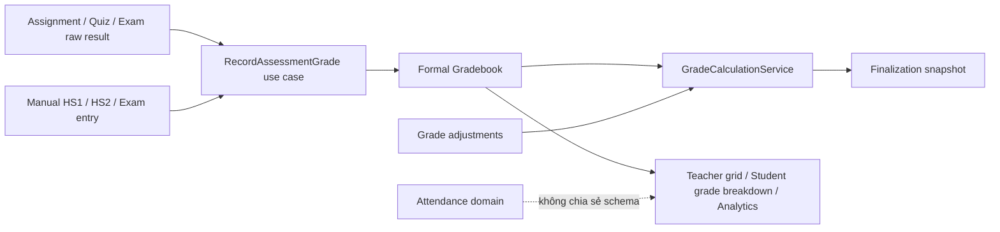

# SmartLMS Formal Gradebook — Discovery & Domain Design

Ngày discovery: 09/08/2026  
Trạng thái: **Hoàn tất thiết kế, chưa triển khai foundation**  
Phạm vi: Gradebook Discovery (Phase 4.1)

## 1. Quy ước bằng chứng

- **[V] Đã kiểm chứng:** được xác nhận trong mã nguồn, migration, test hoặc dữ liệu tổng hợp từ Docker runtime hiện tại.
- **[S] Suy luận:** kết luận hợp lý từ dữ liệu hiện có nhưng chưa phải business rule được mã hóa.
- **[QĐ] Quyết định thiết kế:** quy tắc mục tiêu cho Formal Gradebook; chưa phải behavior production cho đến khi Gradebook Foundation được triển khai.
- **[Gate] Cần xác nhận dữ liệu:** không được tự động migrate trước khi giáo viên/admin xác nhận mapping hoặc policy.

Docker runtime được audit là môi trường đang chạy cùng mã nguồn hiện tại. Các số liệu dưới đây dùng để phát hiện hình dạng dữ liệu và rủi ro migration; không mặc định coi đây là toàn bộ dữ liệu production nếu production dùng database khác.

## 2. Kết luận discovery

**[V] SmartLMS hiện chưa có Formal Gradebook và chưa có một source of truth duy nhất cho điểm chính thức.** Điểm đang nằm trong ba vùng dữ liệu độc lập:

1. `attendance_columns(type = grade)` + `attendance_data.value`: bảng cột tự do, giá trị kiểu chuỗi.
2. `assignment_submissions.grade`: điểm bài tập theo `assignments.grading_scale`.
3. `quiz_attempts.score`: điểm Quiz/Exam chuẩn hóa về thang 10; điểm từng câu ở `quiz_attempt_answers.score`.

Các Dashboard, Class Progress và trang điểm học sinh tự tổng hợp trực tiếp từ những nguồn trên. Chúng chưa cùng dùng một công thức:

- trang điểm học sinh chuẩn hóa Assignment về thang 10, lấy **điểm Quiz cao nhất** và tính trung bình đều Assignment + Quiz;
- Teacher Dashboard chuẩn hóa Assignment về thang 10 để phát hiện học sinh điểm thấp;
- Class Progress lấy Assignment raw, lấy **lượt Quiz mới nhất**, rồi trung bình đều hai trung bình nhóm;
- Student Dashboard chỉ hiển thị trung bình **Quiz cao nhất**;
- công cụ tính điểm HS1/HS2 dùng công thức 40/60 nhưng là JavaScript độc lập, không đọc hoặc ghi dữ liệu Gradebook.

Vì vậy Foundation phải được triển khai theo kiểu **additive + reconcile + cutover**, không đổi nguồn đọc ngay sau khi tạo bảng và không tự áp công thức 40/60 cho mọi khóa học.

## 3. Phạm vi đã audit

### 3.1 Schema và model

- `attendance_columns`, `attendance_data`, `AttendanceColumn`, `AttendanceData`.
- `assignments`, `assignment_submissions`, `Assignments`, `AssignmentSubmission`.
- `quizzes`, `quiz_sessions`, `quiz_attempts`, `quiz_attempt_questions`, `quiz_attempt_answers` và các model tương ứng.
- `audit_logs`, `AuditLog`, `AuditLogger`.
- migration integrity áp unique `(attendance_column_id, user_id)` và `(assignment_id, user_id)`.

### 3.2 Luồng đọc/ghi

- `AttendanceController`, `SaveAttendance`, `SaveAttendanceRequest`.
- `AssignmentController::grade()` và luồng nộp lại bài.
- `QuizAttemptController`, `QuizGradingController`, `QuizExamService`.
- `StudentGradesController`.
- `DashboardController`, `CourseController`, `ClassManagementController`.
- Blade Attendance, Assignment review, Student Grades, Course và công cụ Grade Calculator.

### 3.3 Characterization tests hiện có

- `DashboardMetricsTest`: khóa behavior lấy Quiz score cao nhất trên Student Dashboard và chuẩn hóa Assignment trên Teacher Dashboard.
- `QuizExamFoundationTest`: khóa behavior tính điểm Quiz, chấm tự luận, release và chặn sửa sau release.
- `AttendanceSaveOptimizationTest`: khóa behavior lưu cột Attendance/Grade dạng cell.
- `AuthorizationIsolationTest`: khóa quyền chấm Assignment và isolation theo course.
- `LmsDataIntegrityMigrationTest`: khóa uniqueness của submission và attendance cell.

## 4. Inventory nguồn điểm hiện tại

| Nguồn | Dữ liệu gốc | Thang điểm | Missing hiện tại | Audit/lock hiện tại | Kết luận |
|---|---|---:|---|---|---|
| HS1 / HS2 / Thi thủ công | `attendance_data.value` của cột `type=grade` | Không có schema; UI nhận chuỗi bất kỳ | Chuỗi rỗng hoặc không có row | Không có grade audit; xóa cột cascade toàn bộ giá trị | Legacy, phải migrate có mapping |
| Điểm cộng | Không tìm thấy model, migration hoặc write path chuyên biệt | Chưa xác định | Không áp dụng | Không có | Chưa tồn tại dưới dạng business entity |
| Điểm quá trình | Chỉ được tính trong Grade Calculator độc lập | `(avg HS1 + avg HS2 × 2) / 3` | Input trống bị đổi thành 0 trong calculator | Không lưu, không audit | Không phải official grade hiện tại |
| Điểm thi thủ công | Cột tự do tên `Thi`/`THI` | Thực tế chủ yếu 0–10 nhưng DB không ràng buộc | Có blank và `vắng` | Không audit/lock | Legacy, mapping có xác nhận |
| Assignment grade | `assignment_submissions.grade` | `0..assignments.grading_scale`, mặc định 10 | `NULL` nghĩa là chưa chấm | Có generic `audit_logs` khi chấm qua controller; chưa lock/finalize | Nguồn operational đang active |
| Quiz score | `quiz_attempts.score` | Service chuẩn hóa về 0–10 | `NULL` khi đang làm/chờ chấm | Chặn sửa manual sau `released`; chưa có Gradebook audit | Nguồn operational đang active |
| Exam score | Vẫn là `quiz_attempts.score`; UI suy ra Exam khi Quiz có session | 0–10 | Như Quiz | Có release policy theo session | Chưa có type Exam bền vững ở schema |

### 4.1 Dữ liệu tổng hợp từ Docker runtime

**[V] Snapshot read-only ngày 09/08/2026:**

- 93 cột Attendance, 24 cột Grade, 10 cột Note.
- 24 cột Grade gồm các tên `HS1`, `HS2`, `Thi`/`THI`, `Nhật ký`, `Báo cáo`.
- Không có tên cột Grade trùng sau khi chuẩn hóa `LOWER(TRIM(name))` trong cùng course.
- 176 Assignment submissions; 24 row đã có điểm; min 1.50, max 10.00.
- 27 Assignment đều đang dùng `grading_scale = 10`, dù code cho phép 1–100.
- 43 Quiz attempts: 40 `submitted` có điểm, 1 `released` có điểm, 2 `in_progress` chưa có điểm.
- Runtime hiện chưa có nhóm Quiz nhiều lượt, nhưng code và test hỗ trợ `max_attempts > 1`.
- Giá trị cột Grade có số từ 0 đến 10, chuỗi thập phân dấu phẩy (`6,5`, `7,5`, `8,5`) và 11 giá trị `vắng`.

**Hệ quả migration:**

- Không thể `CAST(attendance_data.value AS DECIMAL)` trực tiếp.
- Có thể chuẩn hóa dấu phẩy thành dấu chấm khi chuỗi khớp chặt định dạng số, nhưng phải lưu raw value và reconciliation checksum.
- `vắng` không được tự động đổi thành 0. Đây có thể là missing, excused hoặc zero tùy quy định lớp.
- `Nhật ký` và `Báo cáo` không được tự động suy ra HS1/HS2 chỉ từ tên.

## 5. Business rule thực tế đã xác nhận

### 5.1 HS1, HS2, điểm quá trình và điểm thi

**[V] Persisted behavior:** backend không biết HS1, HS2, điểm quá trình hay điểm thi. Giáo viên tạo cột `type=grade`, đặt tên tự do và nhập chuỗi tự do. `SaveAttendance` chỉ phân biệt `attendance` với các type còn lại; không validate numeric/range và không tính điểm.

**[V] Grade Calculator độc lập:**

```text
avgHS1       = trung bình các điểm HS1 đã nhập
avgHS2       = trung bình các điểm HS2 đã nhập
processScore = (avgHS1 + avgHS2 × 2) / 3
subjectScore = processScore × 40% + examScore × 60%
```

Calculator coi input trống là 0, hiển thị trung bình hệ 10 và hệ 4 đến 2 chữ số. Nó không liên kết course, student hoặc database.

**[QĐ]** Công thức trên được cung cấp dưới dạng template cấu hình tên **“Trung cấp nghề 40/60”**, không phải default toàn hệ thống. Course chỉ dùng template này khi giáo viên/admin chọn hoặc xác nhận trong migration manifest.

### 5.2 Assignment

**[V]** Mỗi học sinh có đúng một `assignment_submissions` hiện hành cho mỗi Assignment nhờ unique `(assignment_id, user_id)`. Nộp lại là upsert vào cùng row.

**[V]** Giáo viên nhập `grade` trong khoảng `0..grading_scale`; `grading_scale` mặc định 10, code cho phép tới 100. Feedback có thể để trống. Chấm qua controller tạo notification và generic audit log.

**[V]** Nộp lại không tự xóa `grade` hoặc `feedback`, vì upsert chỉ cập nhật file/text/timestamp. Đây là behavior cần được characterization-test trước khi kết nối Gradebook; Foundation không được âm thầm thay đổi.

**[V]** Trang Student Grades chuẩn hóa Assignment sang thang 10 trước khi tính trung bình. Class Progress hiện không chuẩn hóa; runtime chưa lộ sai khác vì mọi Assignment đang có scale 10.

### 5.3 Quiz và Exam

**[V]** Quiz auto/manual cuối cùng được chuẩn hóa về thang 10:

```text
quizScore = round((autoEarned + manualEarned) / totalMax × 10, 2)
```

Quiz auto-only cũng được làm tròn 2 chữ số trong `QuizExamService`. Nhánh legacy trong `QuizAttemptController` làm tròn 1 chữ số, nhưng flow mới có `attempt_id` dùng service.

**[V]** Khi còn câu manual chưa chấm, `score = NULL`, status là `pending_grading`. Khi chấm xong, status thành `graded` hoặc `released` tùy release policy. Manual grade bị chặn sau `released`.

**[V]** `Quiz` và `Exam` không có discriminator trong database. Course UI gọi một Quiz là “Bài thi” khi có `quiz_sessions`; đây là presentation heuristic, không đủ an toàn cho migration chính thức.

**[V]** Chính sách nhiều lượt đang không nhất quán:

- Student Grades và Student Dashboard: điểm cao nhất theo Quiz.
- Class Progress: lượt có `completed_at` mới nhất.
- Course aggregate: trung bình tất cả attempt có score.

**[QĐ]** Mỗi Grade Item liên kết Quiz/Exam phải lưu `attempt_policy`. Default khi tạo mới là `highest_released`, phù hợp behavior đã được test ở màn hình học sinh. Các lựa chọn hợp lệ: `highest_released`, `latest_released`, `first_released`, `teacher_selected`. Không đổi policy sau khi có finalization nếu chưa reopen và audit.

### 5.4 Điểm cộng

**[V]** Không tìm thấy schema hoặc business logic lưu điểm cộng. Không có bằng chứng để migrate tự động.

**[QĐ]** Điểm cộng là một `grade_adjustment`, không phải Grade Item giả và không sửa raw score nguồn. Adjustment luôn có scope, amount, reason, actor và audit. Không cho vượt max score trừ khi category/period được cấu hình `allow_over_max = true`.

### 5.5 Missing và số 0

**[V]** Hiện tại `NULL` Assignment/Quiz bị loại khỏi average; Assignment chưa nộp không có row; Attendance Grade có thể blank hoặc chuỗi `vắng`. Số 0 là một điểm hợp lệ và không được coi là missing.

**[QĐ]** Formal Gradebook phân biệt rõ:

- `ungraded`: có bài/grade item nhưng giáo viên chưa chấm;
- `missing`: quá hạn hoặc được đánh dấu thiếu bài;
- `excused`: được miễn, không tham gia mẫu số;
- `graded`: có điểm, kể cả 0;
- `excluded`: bị loại khỏi phép tính theo quyết định có audit.

Mặc định tương thích là không đổi `ungraded`/`missing` thành 0. Finalization bị chặn khi còn trạng thái chưa giải quyết, trừ khi period có policy được cấu hình rõ là `exclude_missing` hoặc `zero_missing`.

### 5.6 Rounding

**[V]** Hiện có ba precision: Quiz service 2 chữ số, các Dashboard/Progress 1 chữ số, Grade Calculator 2 chữ số.

**[QĐ]** Lưu điểm raw và kết quả trung gian bằng decimal, không round ở từng bước. Chỉ round ở boundary hiển thị và snapshot finalization. `grading_periods` lưu `rounding_precision` và `rounding_mode`; template tương thích mặc định dùng precision 1, `PHP_ROUND_HALF_UP`. Test bắt buộc phải khóa trường hợp .05 và không dùng float cho phép tính domain.

## 6. Kiến trúc domain mục tiêu



### 6.1 Boundary

**[QĐ]** Gradebook thuộc domain `Assessment/Gradebook` trong modular monolith:

```text
Controller
  -> FormRequest + Policy
  -> Application Use Case
  -> Gradebook Domain Service / Query Object
  -> Eloquent + DB transaction
```

- Assessment giữ raw evidence: bài nộp, attempt, rubric answer và feedback.
- Gradebook giữ **điểm chính thức** và formula/finalization.
- Attendance chỉ giữ trạng thái chuyên cần; không tạo cột Grade mới sau cutover.
- Dashboard/Analytics đọc Gradebook read model sau khi reconciliation đạt yêu cầu.
- Không tạo generic repository cho Eloquent.

## 7. Thiết kế dữ liệu

Tất cả điểm dùng `DECIMAL`, không dùng `FLOAT`. Timestamps theo UTC; UI hiển thị timezone ứng dụng.

### 7.1 `grading_periods`

Mục đích: biên tính/chốt điểm của một course, ví dụ “Học kỳ 1”, “Khóa 2026”.

| Field | Ý nghĩa |
|---|---|
| `id` | PK |
| `course_id` | Course sở hữu period |
| `code`, `name` | Mã ổn định và tên hiển thị |
| `starts_at`, `ends_at` | Khoảng thời gian nullable |
| `status` | `draft`, `open`, `closed` |
| `missing_policy` | `block`, `exclude`, `zero` |
| `rounding_precision` | 0–4 |
| `rounding_mode` | enum domain, mặc định `half_up` |
| `calculation_version` | version thuật toán/config |
| timestamps | metadata |

Constraints/indexes:

- unique `(course_id, code)`;
- check `starts_at <= ends_at` khi DB hỗ trợ;
- index `(course_id, status)`.

Không tạo mô hình học kỳ toàn trường trong Foundation vì SmartLMS chưa có Academic Term domain. Có thể bổ sung `academic_term_id` nullable sau này.

### 7.2 `grade_categories`

Mục đích: nhóm Grade Item và quy định mức đóng góp của nhóm vào điểm cuối.

| Field | Ý nghĩa |
|---|---|
| `id`, `course_id`, `grading_period_id` | identity/scope |
| `code`, `name` | ví dụ `process`, `exam` |
| `weight_percent` | trọng số category trong final, decimal 0–100 |
| `aggregation_method` | Foundation dùng `weighted_mean` |
| `allow_over_max` | cho phép bonus vượt max hay không |
| `position`, `is_active` | sắp xếp/lifecycle |
| timestamps | metadata |

Constraints/indexes:

- unique `(grading_period_id, code)`;
- check `weight_percent >= 0 AND weight_percent <= 100`;
- index `(course_id, grading_period_id, position)`;
- tổng weight = 100 được validate trong application service và bắt buộc trước finalize, vì SQL check không thể an toàn kiểm tra nhiều row.

### 7.3 `grade_items`

Mục đích: một thành phần điểm cụ thể như HS1 lần 1, HS2, Assignment A, Quiz B hoặc Thi cuối kỳ.

| Field | Ý nghĩa |
|---|---|
| `id`, `course_id`, `grading_period_id`, `grade_category_id` | scope |
| `code`, `name` | identity trong period |
| `item_type` | `manual`, `hs1`, `hs2`, `assignment`, `quiz`, `exam` |
| `source_type` | `manual`, `legacy_attendance`, `assignment`, `quiz` |
| `source_id` | ID nguồn, nullable cho manual |
| `max_points` | thang điểm nguồn, > 0 |
| `item_weight` | trọng số nội bộ category; HS1=1, HS2=2 trong template 40/60 |
| `attempt_policy` | nullable hoặc một policy Quiz đã định nghĩa |
| `due_at` | dùng cho missing/work queue |
| `position`, `is_published`, `is_locked` | lifecycle |
| `version` | optimistic concurrency |
| timestamps | metadata |

Constraints/indexes:

- unique `(grading_period_id, code)`;
- unique `(grading_period_id, source_type, source_id)` khi `source_id` khác null; với MySQL cần thiết kế index/guard tương thích nullable;
- check `max_points > 0`, `item_weight > 0`;
- index `(course_id, grading_period_id, grade_category_id, position)`;
- index `(source_type, source_id)`;
- application invariant: category/course/period của item phải cùng scope.

`item_weight` và `category.weight_percent` không trùng nghĩa:

- `item_weight`: HS1/HS2 hoặc tầm quan trọng giữa item trong cùng category;
- `weight_percent`: phần trăm category đóng góp vào final.

### 7.4 `grades`

Mục đích: điểm chính thức hiện hành của một học sinh cho một Grade Item.

| Field | Ý nghĩa |
|---|---|
| `id`, `grade_item_id`, `user_id` | identity |
| `status` | `ungraded`, `missing`, `excused`, `graded`, `excluded` |
| `raw_points` | điểm nguồn trước adjustment, nullable |
| `effective_points` | projection hiện hành sau adjustment/override |
| `source_version` | version/hash của nguồn Assessment đã đồng bộ |
| `graded_by`, `graded_at` | actor/time |
| `version` | optimistic concurrency |
| timestamps | metadata |

Constraints/indexes:

- unique `(grade_item_id, user_id)` chống duplicate/race;
- check points không âm; upper bound được service kiểm soát theo `allow_over_max`;
- `graded` bắt buộc có `raw_points`; các status còn lại không được tự suy thành 0;
- index `(user_id, status)` và `(grade_item_id, status)`.

`effective_points` là projection có thể rebuild từ raw + adjustments. Nó giúp grid đọc nhanh nhưng không thay thế adjustment ledger.

### 7.5 `grade_adjustments`

Mục đích: ledger bất biến cho bonus, penalty, manual override và reversal.

| Field | Ý nghĩa |
|---|---|
| `id`, `grading_period_id`, `user_id` | scope bắt buộc |
| `grade_id` | nullable nếu adjustment ở final/category scope |
| `grade_category_id` | nullable |
| `type` | `bonus`, `penalty`, `override`, `reversal` |
| `scope` | `item`, `category`, `final` |
| `amount` | delta hoặc absolute value của override |
| `reason` | bắt buộc, không rỗng |
| `adjusted_by`, `adjusted_at` | actor/time |
| `reverses_adjustment_id` | nullable, tham chiếu ledger row cũ |
| `idempotency_key` | chống request lặp |
| timestamps | metadata |

Constraints/indexes:

- unique `idempotency_key`;
- check đúng một target tương ứng với scope;
- adjustment đã ghi không update/delete; sửa bằng reversal + row mới;
- index `(user_id, grading_period_id, adjusted_at)` và `grade_id`.

### 7.6 `grade_change_logs`

Mục đích: audit bắt buộc, transactionally consistent cho thay đổi điểm. Không thay thế bằng generic `audit_logs` đang fail-open.

Fields chính:

- `grade_id`, `grade_item_id`, `user_id`, `actor_id`;
- `action`: create/update/status/adjust/finalize/reopen/sync;
- `before`, `after` JSON;
- `reason`, `source`, `correlation_id`, `request_id`;
- `created_at` (không cần `updated_at`).

Constraints/indexes:

- append-only ở application layer;
- unique `(correlation_id, action, grade_id)` để hỗ trợ retry idempotent;
- index `(grade_id, created_at)`, `(user_id, created_at)`, `(actor_id, created_at)`.

### 7.7 `grade_finalizations`

Mục đích: snapshot điểm cuối đã chốt cho một học sinh trong một course/period.

| Field | Ý nghĩa |
|---|---|
| `id`, `course_id`, `grading_period_id`, `user_id` | scope |
| `state` | `draft`, `finalized`, `reopened` |
| `final_score` | kết quả đã round |
| `unrounded_score` | kết quả trước round |
| `formula_snapshot` | category/item/weight/missing/rounding đã dùng |
| `grade_snapshot` | các grade/adjustment/version tham gia |
| `calculation_hash` | checksum deterministic |
| `version` | số lần finalize/reopen |
| `finalized_by`, `finalized_at` | actor/time |
| `reopened_by`, `reopened_at`, `reopen_reason` | audit reopen |
| timestamps | metadata |

Constraints/indexes:

- unique `(grading_period_id, user_id)` cho state hiện hành;
- index `(course_id, grading_period_id, state)`;
- finalization chỉ thành công trong transaction sau khi lock Grade Item/Grade liên quan và kiểm tra version/hash;
- lịch sử mỗi lần finalize/reopen nằm trong `grade_change_logs`; snapshot cũ không bị mất.

## 8. Công thức Gradebook

### 8.1 Chuẩn hóa item

```text
normalized_item_score = effective_points / max_points × 10
```

Không round tại bước này.

### 8.2 Category

Với các item đủ điều kiện tham gia:

```text
category_score = Σ(normalized_item_score × item_weight)
                 / Σ(item_weight)
```

- `excused`/`excluded`: không vào tử và mẫu.
- `ungraded`/`missing`: xử lý theo `grading_period.missing_policy`.
- `graded = 0`: tham gia đầy đủ với giá trị 0.

### 8.3 Final

```text
unrounded_final = Σ(category_score × weight_percent) / 100
final_score     = round(unrounded_final, configured precision/mode)
```

Trước finalize, tổng weight của category active phải bằng đúng 100. Category không có item đủ điều kiện phải được xử lý hoặc finalization bị chặn.

### 8.4 Mapping HS1/HS2/Thi

Template “Trung cấp nghề 40/60”:

- category `process`: `weight_percent = 40`;
- mỗi HS1 là một Grade Item `item_type=hs1`, `item_weight=1`;
- mỗi HS2 là một Grade Item `item_type=hs2`, `item_weight=2`;
- category `exam`: `weight_percent = 60`;
- điểm Thi là Grade Item `item_type=exam`, `item_weight=1`.

Cách này tổng quát hóa đúng công thức calculator khi có một HS1 và một HS2, đồng thời xử lý đúng nhiều cột HS1/HS2 mà không cần trung bình hai lần. Template chỉ được áp dụng sau xác nhận; không tự gán theo tên cột.

### 8.5 Assignment/Quiz/Exam

- Assessment không tự động ảnh hưởng điểm chính thức chỉ vì đã tồn tại.
- Giáo viên publish một Grade Item liên kết Assessment và chọn category/item weight.
- Assignment raw score giữ đúng `grading_scale`; Gradebook chuẩn hóa khi tính.
- Quiz/Exam raw score đang ở thang 10; `max_points=10` khi backfill.
- Một Quiz có session không tự động thành Exam. `item_type` là quyết định explicit.
- `attempt_policy` chọn đúng một attempt làm nguồn. Foundation mặc định `highest_released`; thay đổi policy cần audit.

## 9. Source of truth và đồng bộ

### 9.1 Sau cutover

**[QĐ] `grades` là source of truth duy nhất cho điểm chính thức.**

- `assignment_submissions.grade` và `quiz_attempts.score` vẫn giữ raw operational result/evidence để review bài.
- Việc chấm Assignment/Quiz gọi application use case ghi Assessment và project sang `grades` trong cùng transaction khi cùng database.
- Nếu projection lỗi, toàn transaction rollback; không chấp nhận điểm raw đổi mà official grade không đổi.
- Dashboard, Student Grades, Class Progress và Gradebook UI đọc từ Gradebook query objects.
- AI suggested score không bao giờ tự ghi `grades`; giáo viên phải xác nhận.

### 9.2 Trong giai đoạn chuyển tiếp

1. Legacy sources vẫn là read source.
2. Shadow backfill Gradebook.
3. Dual-write có idempotency.
4. Reconcile theo count, checksum và sample.
5. Shadow-read so sánh nhưng chưa hiển thị.
6. Cutover từng màn hình sau khi sai lệch được giải thích.
7. Legacy fields deprecate; chưa drop trong Phase 4.

Không dùng database trigger vì logic policy/audit khó kiểm thử và khó rollback. Đồng bộ đi qua application services.

## 10. Finalize, lock, reopen và override

### 10.1 Finalize

Finalization bị chặn khi:

- category weights không bằng 100;
- item/category khác scope;
- còn missing/ungraded mà policy là `block`;
- source version đã đổi trong lúc tính;
- có score ngoài range chưa được resolve;
- Grade Item đang draft/unpublished nhưng bị tham chiếu sai.

Khi thành công:

- khóa transaction và kiểm tra optimistic version;
- tính lại từ source of truth, không tin subtotal gửi từ frontend;
- ghi snapshot, hash, actor và audit;
- các Grade/Item liên quan được xem là locked theo period/student scope.

### 10.2 Locked grade

- Teacher không sửa grade/adjustment của student-period đã finalized.
- Chấm lại raw Assessment sau finalize không tự đổi official grade; request phải bị chặn hoặc yêu cầu reopen trước.
- Admin cũng không bypass im lặng; phải dùng use case reopen với lý do.

### 10.3 Reopen

- Chỉ course teacher được phân quyền hoặc admin có permission chuyên biệt.
- Bắt buộc `reopen_reason`.
- Tăng version, ghi log before/after và giữ snapshot cũ trong audit.
- Sau sửa phải finalize lại; UI hiển thị rõ `reopened` chứ không coi là chưa từng chốt.

### 10.4 Manual override

- Không overwrite raw source score.
- Tạo adjustment `type=override`, amount là absolute effective score, reason bắt buộc.
- Override mới reversal override cũ trong cùng transaction.
- Không override khi finalized nếu chưa reopen.

## 11. Authorization

- Student chỉ đọc Grade Item đã publish và Grade/Finalization của chính mình.
- Course teacher chỉ cấu hình/chấm/finalize course mình quản lý.
- Admin có quyền quản trị nhưng mọi change/finalize/reopen vẫn bắt buộc actor + reason theo action.
- Không dùng role check rải rác; Policy kiểm tra ownership qua Course.
- Grade grid endpoint phải chống IDOR đồng thời ở Grade Item, student enrollment và period.
- Bulk action re-query toàn bộ ID trong authorized scope; không tin danh sách frontend.

## 12. Kế hoạch migration dữ liệu cũ

### 12.1 Nguyên tắc

- Additive, idempotent, chunked, có checkpoint.
- Không xóa hoặc đổi `attendance_data`, Assignment grade, Quiz score trong bước backfill.
- Preflight/dedupe trước constraint.
- Backup snapshot các row legacy được map; lưu migration run/checksum và log lỗi.
- Rollback chỉ xóa dữ liệu Gradebook do migration run tạo ra khi chưa cutover/finalize; không đụng raw source.
- Sau cutover, rollback là chuyển read flag về legacy, không drop bảng.

### 12.2 Preflight bắt buộc

Command dự kiến:

```text
php artisan smartlms:gradebook-discover --course=<id> --output=<manifest.json>
php artisan smartlms:gradebook-backfill --manifest=<manifest.json> --dry-run
php artisan smartlms:gradebook-reconcile --run=<uuid>
```

Report phải có:

- course/period/category/item mapping;
- duplicate source mapping;
- student không còn enrollment;
- raw value blank, decimal comma, non-numeric, ngoài range;
- Assignment grade ngoài `grading_scale`;
- Quiz attempt policy và candidate attempts;
- count source/target, checksum và row lỗi;
- estimate số Grade/Adjustment/Finalization sẽ tạo.

### 12.3 Mapping theo nguồn

#### Attendance Grade legacy

- Tạo manifest liệt kê từng `attendance_column_id` và mapping explicit: category, item type, max points, item weight.
- Tên `HS1`, `HS2`, `Thi` chỉ là suggestion trong report, không tự approve.
- Chuỗi numeric dấu chấm: parse strict.
- Chuỗi numeric dấu phẩy: normalize có log raw/normalized.
- Blank: tạo trạng thái theo manifest, mặc định `ungraded`.
- `vắng`: **[Gate]** giáo viên chọn `missing`, `excused` hoặc điểm 0; không migrate trước quyết định.
- Chuỗi khác: quarantine trong report, không bỏ qua im lặng.
- `Nhật ký`, `Báo cáo`: **[Gate]** xác nhận đây là điểm, note hay grade item khác.

#### Assignment

- Một Grade Item trên mỗi Assignment được giáo viên chọn đưa vào Gradebook.
- `source_type=assignment`, `source_id=assignment.id`, `max_points=grading_scale`.
- Submission có grade tạo `grades.status=graded`; chưa grade là `ungraded`; Assignment quá hạn chưa submission có thể là `missing` theo policy sau khi item publish.
- Backfill giữ full decimal, không round.

#### Quiz/Exam

- Một Grade Item trên mỗi Quiz được chọn.
- Giáo viên xác nhận `item_type=quiz|exam`, category và attempt policy.
- Chỉ attempt đủ điều kiện theo policy và release semantics được project.
- Attempt `pending_grading` tạo `ungraded`, không tạo điểm 0.
- Lưu `source_version`/attempt ID đã chọn trong grade log/snapshot để reconciliation giải thích được.

#### Điểm cộng

- Không có auto-backfill vì không tìm thấy source đáng tin cậy.
- Nếu điểm cộng đang được cộng trực tiếp vào cột legacy, cần business owner cung cấp mapping hoặc import adjustment riêng có reason; không suy ra từ score.

### 12.4 Cutover gates

Không chuyển read source nếu chưa đạt tất cả:

- 0 duplicate theo unique keys mục tiêu;
- 0 row bị bỏ qua không có lý do;
- 100% source row được `mapped`, `quarantined` hoặc `explicitly_excluded`;
- reconciliation count/checksum pass;
- characterization tests legacy và domain tests pass;
- teacher review sample ít nhất theo từng kiểu HS1/HS2/Thi/Assignment/Quiz/Exam;
- rollback/read feature flag đã diễn tập trên staging.

## 13. Race condition và idempotency

- Hai request chấm cùng item/student: unique `(grade_item_id, user_id)` + transaction + `lockForUpdate`/optimistic `version`.
- Assessment projection retry: unique source mapping + `idempotency_key`/`correlation_id`.
- Finalize đồng thời với grade update: lock period/student grade set, kiểm tra calculation hash/version trước commit.
- Bulk import: mỗi batch có run UUID/checkpoint; retry không tạo duplicate adjustment/log.
- Thay đổi formula/category sau khi đã finalize: bị chặn cho đến khi reopen tất cả finalization chịu ảnh hưởng hoặc clone sang period/version mới.

## 14. Query/read architecture và performance budget

Query Objects dự kiến:

- `TeacherGradebookGridQuery`;
- `StudentGradeBreakdownQuery`;
- `GradeFormulaPreviewQuery`;
- `FinalizationReadinessQuery`.

Nguyên tắc:

- server-side pagination theo student, không tải toàn bộ ma trận;
- Grade Item/category metadata tải một lần theo period;
- query grades theo page student IDs + item IDs;
- audit history tải riêng theo grade/student detail;
- không tính N×M bằng query trong loop;
- final calculation chạy domain service theo batch, không dựa vào Blade/JavaScript.

Indexes ưu tiên đã nêu trong từng bảng. Cache chỉ dùng cho metadata category/item versioned; không cache để che query xấu và không dùng cache làm source of truth cho final score.

Budget đề xuất cho Teacher Gradebook page đầu:

- <= 12 SQL queries;
- page 30–50 students;
- p95 server response <= 500 ms trên dataset staging đại diện;
- bulk save chỉ ghi dirty grades và một audit row cho mỗi thay đổi.

## 15. Test plan cho Gradebook Foundation

### 15.1 Characterization trước extraction/cutover

- Assignment grade validate scale, notification, audit và behavior nộp lại sau chấm.
- Quiz auto score 0–10, manual pending/graded/released, chặn sửa sau release.
- Best-vs-latest behavior hiện tại của Student Grades, Dashboard, Class Progress và Course aggregate.
- Attendance Grade lưu raw blank, decimal comma và `vắng`.

### 15.2 Unit/domain tests bắt buộc

- HS1 weight 1;
- HS2 weight 2;
- Process + Exam category weights;
- Assignment scale khác 10;
- Quiz/Exam attempt policy;
- bonus/penalty/override/reversal;
- `ungraded`, `missing`, `excused`, `excluded`, graded zero;
- missing policy `block`, `exclude`, `zero`;
- no intermediate rounding và configured final rounding;
- category weights không bằng 100 bị chặn;
- manual adjustment/override có reason;
- locked grade không sửa được;
- finalize/reopen/refinalize giữ audit/snapshot;
- idempotent projection và concurrent update.

### 15.3 Feature/integration tests

- teacher configure period/category/item trong authorized course;
- student chỉ xem điểm đã publish của mình;
- Assignment/Quiz grading project đúng vào Gradebook;
- AI suggestion không tự ghi official grade;
- bulk update chống IDOR và stale version;
- backfill dry-run không ghi dữ liệu;
- backfill decimal comma, quarantine `vắng`, checkpoint/retry;
- reconcile và rollback/read flag.

## 16. Rủi ro đã xác nhận và cách xử lý

| Mức | Vấn đề hiện tại | Tại sao là vấn đề | Giải pháp | Độ khó | Giá trị |
|---|---|---|---|---|---|
| Critical | Ba nguồn điểm, nhiều công thức đọc | Không có điểm chính thức nhất quán | Formal Gradebook + staged cutover | XL | Rất cao |
| Critical | Attendance Grade là chuỗi tự do, có `vắng` và decimal comma | Auto cast có thể làm sai/mất nghĩa dữ liệu | Manifest, quarantine, backup, reconcile | L | Rất cao |
| High | Best/latest/all Quiz attempt khác nhau theo màn hình | Cùng học sinh có thể thấy nhiều “điểm TB” | Attempt policy trên Grade Item | M | Cao |
| High | Grade Calculator 40/60 tách biệt | Dễ bị hiểu nhầm là official formula | Chỉ cung cấp template opt-in | M | Cao |
| High | Finalize/lock/reopen chưa tồn tại | Điểm có thể đổi sau công bố mà thiếu governance | Finalization snapshot + policy + audit | L | Rất cao |
| High | Assignment audit là generic và fail-open | Grade có thể đổi dù audit ghi thất bại | Transactional grade change log | M | Cao |
| Medium | Class Progress không normalize Assignment scale | Sai khi scale khác 10 | Canonical calculation service | M | Cao |
| Medium | Exam chỉ được suy ra từ session | Không đủ semantic để map category | Explicit Grade Item type | S | Cao |
| Medium | Bonus chưa có entity | Cộng trực tiếp làm mất trace | Immutable adjustments | M | Cao |
| Medium | Rounding không nhất quán | Có thể lệch điểm hiển thị/chốt | Period rounding policy | S | Trung bình |

## 17. Các quyết định không được thay đổi âm thầm khi implement

1. Không tự áp template 40/60 cho mọi course.
2. Không tự đổi `vắng` thành 0.
3. Không coi missing là 0 nếu chưa có policy explicit.
4. Không dùng sự hiện diện của Quiz Session làm discriminator duy nhất cho Exam.
5. Không ghi AI suggested score thành official grade nếu giáo viên chưa xác nhận.
6. Không sửa raw Assignment/Quiz score khi tạo adjustment/override.
7. Không cho sửa Grade đã finalized nếu chưa reopen có reason.
8. Không chuyển Dashboard/Class Progress/Student Grades sang Gradebook trước reconciliation.
9. Không drop cột/bảng legacy trong Phase 4.
10. Không trộn Attendance schema với Formal Gradebook.

## 18. Trình tự triển khai sau discovery

### 18.1 Gradebook Foundation

1. Thêm characterization tests còn thiếu.
2. Migrations additive cho 7 bảng, constraints/indexes và rollback an toàn.
3. Models + Policies + FormRequests.
4. Calculation, adjustment, projection, audit, finalize/reopen services.
5. Command discovery/backfill/reconcile/rollback và feature flag read source.
6. Backfill staging bằng manifest đã duyệt; so sánh legacy/formal.

### 18.2 Gradebook UI

Chỉ bắt đầu sau khi Foundation tests và reconciliation pass. UI phải hiển thị rõ category, item weight, category weight, source, formula, missing status, lock/finalization và audit.

### 18.3 Teacher Work Queue và Student Today

Không triển khai trong Discovery. Ready-to-Grade Inbox dùng Assessment status; Student Today dùng nguồn deterministic. Cả hai chỉ đọc điểm chính thức từ Gradebook sau cutover, nhưng không làm Gradebook phụ thuộc hai module này.

## 19. Definition of Done cho Discovery

- [x] Xác định tất cả nguồn điểm active và legacy.
- [x] Xác nhận công thức/cách tổng hợp đang tồn tại trong code.
- [x] Phân biệt Grade Calculator độc lập với official grade.
- [x] Xác nhận rủi ro dữ liệu thực tế bằng query tổng hợp read-only.
- [x] Thiết kế category, item, grade, adjustment, audit, period và finalization.
- [x] Định nghĩa HS1/HS2/Assignment/Quiz/Exam/bonus/missing/rounding/override.
- [x] Định nghĩa source of truth, lock/finalize/reopen.
- [x] Định nghĩa migration, reconciliation, rollback, race/idempotency và test plan.
- [x] Chưa tạo migration/model/UI hoặc thay đổi behavior production.

